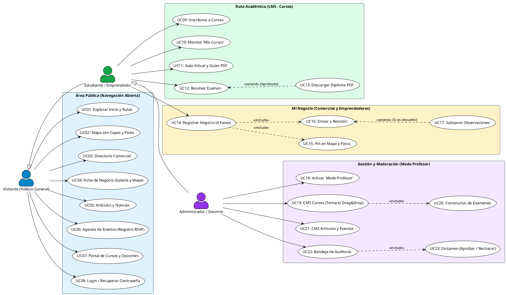
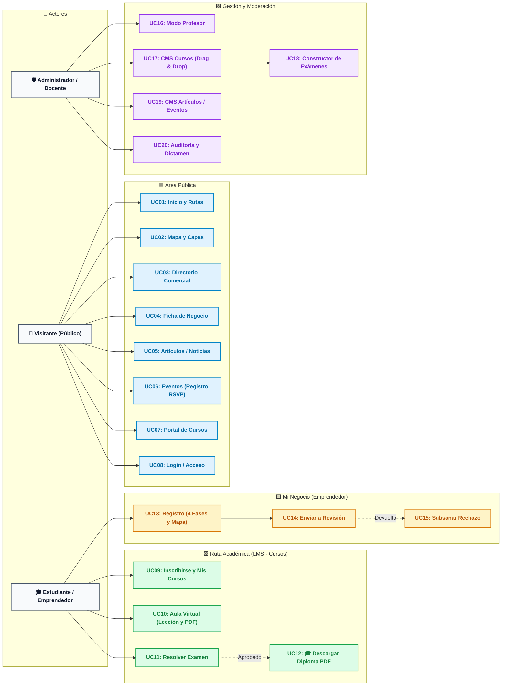

# **Diagrama 1: Casos de Uso del Sistema**

Este diagrama modela las interacciones entre los actores y las funcionalidades principales del sistema, utilizando palabras clave concisas, agrupación por paquetes y codificación de colores para máxima legibilidad.

---

## **1. Glosario de Abreviaturas y Términos Utilizados**

Para facilitar la lectura y evaluación del diagrama, a continuación se describe el significado de cada abreviatura empleada:

| Abreviatura / Término | Significado Completo | Descripción en la Plataforma |
| :--- | :--- | :--- |
| **UC (ej. UC01, UC02...)** | **Caso de Uso** (*Use Case*) | Acción o tarea específica que un usuario puede ejecutar en el sistema. |
| **LMS** | **Sistema de Gestión de Aprendizaje** (*Learning Management System*) | Módulo de cursos, temarios, lecciones en video/texto, evaluaciones y diplomas. |
| **CMS** | **Sistema de Gestión de Contenidos** (*Content Management System*) | Módulo para redactar, editar y publicar artículos, noticias y eventos. |
| **RSVP** | **Registro / Confirmación de Asistencia** (*Répondez s'il vous plaît*) | Botón o enlace para registrarse y apartar lugar en un evento institucional. |
| **PDF** | **Documento Digital Descargable** (*Portable Document Format*) | Formato de los diplomas oficiales y de las guías de estudio descargables. |
| **Drag & Drop** | **Arrastrar y Soltar** | Mecanismo interactivo para reordenar unidades y exámenes en el temario. |
| **Trade / Mi Negocio** | **Comercio / Negocio Local** | Ficha comercial registrada por un prestador de servicios turísticos. |

---

## **2. Convención de Colores por Módulo**

* 🟦 **Área Pública (Azul):** Exploración territorial, directorios, fichas, artículos y eventos.
* 🟩 **Área Académica / LMS (Verde):** Cursos, lecciones, evaluaciones y diplomas.
* 🟨 **Área Comercial / Emprendedor (Ámbar):** Registro en 4 fases, geolocalización y subsanación.
* 🟪 **Área de Gestión / Moderación (Púrpura):** Modo profesor, CMS de contenidos y auditoría comercial.

---

## **3. Versión en PlantUML (Compatible con [plantuml.com](https://www.plantuml.com/plantuml/uml/))**

> **Instrucciones:** Copia el siguiente código y pégalo en [https://www.plantuml.com/plantuml/uml/](https://www.plantuml.com/plantuml/uml/) para generar la imagen vectorial con colores.

---

## **4. Versión en Mermaid (Renderizado Directo con Colores)**

