# **Diagrama 1: Casos de Uso del Sistema**

Este documento modela de forma oficial y exhaustiva los **casos de uso** de la **Plataforma Web de la Reserva de la Biosfera Tehuacán-Cuicatlán**, especificando las interacciones entre los actores del sistema y las funcionalidades disponibles, agrupadas en sus seis áreas funcionales.

---

## **1. Actores Oficiales del Sistema**

La plataforma reconoce formalmente tres actores que interactúan con sus funcionalidades:

| Actor | Descripción Funcional |
| :--- | :--- |
| **Visitante** | Usuario público no autenticado. Navega por el portal libremente para consultar información turística, cultural, eventos, directorio comercial, oferta formativa y acceder a los mecanismos de autenticación y registro. |
| **Alumno/Productor** | Usuario autenticado que interactúa con dos vertientes funcionales clave: la **formativa** (exploración, inscripción, aula virtual, exámenes y certificación en capacitaciones comunitarias) y la **productiva/comercial** (creación, edición, carga de evidencias de su negocio y trámite de solicitud para el directorio oficial). También accede a contenidos de interés y gestiona su perfil. |
| **Profesor** | Usuario autenticado con atribuciones docentes y evaluadoras. Administra el catálogo de cursos, temarios multimedia, materiales descargables y evaluaciones; gestiona noticias y eventos comunitarios; audita expedientes de iniciativas comerciales y emite dictámenes de aprobación o rechazo con observaciones. Comparte además el acceso público y la configuración de su perfil. |

> **Nota de especificación:** En este modelo funcional validado **no se establece generalización ni herencia** entre los tres actores; cada actor se vincula de manera explícita con los casos de uso que está facultado para ejecutar.

---

## **2. Frontera del Sistema y Agrupaciones Funcionales**

La frontera global del sistema es la **"Plataforma Web de la Reserva de la Biosfera Tehuacán-Cuicatlán"**. Dentro de ella, las funcionalidades se organizan en seis agrupaciones funcionales:

1. **Área Pública (UC01 – UC10):** Difusión territorial, mapas, directorio, novedades y mecanismos de acceso a la cuenta.
2. **Formación (UC11 – UC17):** Proceso de capacitación comunitaria: catálogo interno, inscripción directa, seguimiento de avance, aula virtual, evaluaciones y emisión de certificados.
3. **Gestión del Negocio (UC18 – UC20):** Administración integral del expediente comercial de productores locales, postulación al directorio oficial y subsanación de observaciones.
4. **Contenido del Usuario (UC29):** Centro de consulta y descubrimiento de enlaces de interés y artículos categorizados para miembros registrados.
5. **Perfil de Usuario (UC28):** Administración de credenciales de seguridad, datos personales y cuenta propia (compartido por Alumno/Productor y Profesor).
6. **Gestión Docente (UC21 – UC27):** Herramientas de autoría pedagógica, administración editorial de contenidos y auditoría/dictaminación comercial.

---

## **3. Catálogo Oficial de los 29 Casos de Uso**

| Código | Caso de Uso | Agrupación Funcional | Actores Asociados | Descripción de la Funcionalidad |
| :--- | :--- | :--- | :--- | :--- |
| **UC01** | Explorar página de inicio | Área Pública | Visitante, Alumno/Productor, Profesor | Navegar por la portada principal, visualizando postales de la Reserva, secciones informativas, accesos rápidos y eventos destacados. |
| **UC02** | Consultar mapa | Área Pública | Visitante, Alumno/Productor, Profesor | Explorar el mapa interactivo territorial (Leaflet), alternar capas geográficas (Reserva, Rutas 1, 2 y 3, Municipios) y filtrar comercios por giro. |
| **UC03** | Consultar directorio comercial | Área Pública | Visitante, Alumno/Productor, Profesor | Buscar iniciativas ecoturísticas y de servicios mediante filtros combinados de giro comercial y región geográfica. |
| **UC04** | Consultar detalle de negocio | Área Pública | Visitante, Alumno/Productor, Profesor | Ver la ficha comercial completa de un negocio aprobado: fotos, actividades clave, certificaciones, contactos y ubicación en mapa. |
| **UC05** | Consultar cursos | Área Pública | Visitante, Alumno/Productor, Profesor | Conocer la oferta educativa institucional, objetivos de capacitación continua y el cuerpo docente asesor del ITT/DEPI. |
| **UC06** | Consultar artículos | Área Pública | Visitante, Alumno/Productor, Profesor | Leer notas y artículos de divulgación publicados individualmente mediante enlaces de interés y barra lateral de lectura continua. |
| **UC07** | Consultar eventos | Área Pública | Visitante, Alumno/Productor, Profesor | Revisar la cartelera de eventos, fechas, sedes, temarios, ponentes invitados y enlaces externos de convocatoria. |
| **UC08** | Iniciar sesión | Área Pública | Visitante | Autenticarse en la plataforma ingresando correo electrónico y contraseña mediante Laravel Fortify. |
| **UC09** | Registrarse | Área Pública | Visitante | Dar de alta una nueva cuenta de usuario en el sistema proporcionando nombre, correo electrónico y contraseña. |
| **UC10** | Recuperar contraseña | Área Pública | Visitante | Solicitar restablecimiento de contraseña vía correo electrónico y generar una nueva credencial mediante token seguro. |
| **UC11** | Explorar cursos | Formación | Alumno/Productor | Consultar el catálogo interactivo de cursos disponibles dentro del panel privado, filtrando por título y categorías temáticas. |
| **UC12** | Inscribirse a curso | Formación | Alumno/Productor | Realizar el registro de acceso gratuito a un curso publicado, quedando vinculado de manera inmediata en la plataforma. |
| **UC13** | Consultar mis cursos | Formación | Alumno/Productor | Monitorear el progreso académico en el panel principal ("Mis Cursos"), visualizando cursos activos, terminados y avance porcentual. |
| **UC14** | Estudiar en aula virtual | Formación | Alumno/Productor | Consumir lecciones multimedia (videos, infografías, lecturas), descargar materiales de apoyo adjuntos y registrar el avance de cada unidad. |
| **UC15** | Resolver examen | Formación | Alumno/Productor | Contestar las evaluaciones asociadas a los cursos dentro del límite de intentos permitidos y enviar las respuestas para su calificación. |
| **UC16** | Consultar resultados | Formación | Alumno/Productor | Revisar la calificación obtenida (0 a 100%), el estado de acreditación (Aprobado / Reprobado) y el historial de intentos realizados. |
| **UC17** | Descargar certificado | Formación | Alumno/Productor | Descargar el certificado oficial en formato PDF al haber acreditado el 100% de los capítulos y el 100% de los exámenes del curso. |
| **UC18** | Gestionar mi negocio | Gestión del Negocio | Alumno/Productor | Registrar un comercio local en borrador y editar su expediente: datos generales, giros, galería fotográfica, certificados y coordenadas GPS. |
| **UC19** | Enviar solicitud a revisión | Gestión del Negocio | Alumno/Productor | Postular formalmente el expediente comercial completo para que sea auditado por el equipo docente, pasando a estado pendiente. |
| **UC20** | Subsanar observaciones | Gestión del Negocio | Alumno/Productor | Revisar las observaciones de rechazo emitidas por el revisor, corregir la información en el expediente y reenviar la solicitud a revisión. |
| **UC21** | Gestionar cursos | Gestión Docente | Profesor | Crear nuevos cursos, configurar datos informativos (título, descripción, categoría, portada, costo/gratuidad) y controlar su publicación o eliminación. |
| **UC22** | Gestionar exámenes | Gestión Docente | Profesor | Crear y estructurar exámenes de curso, configurar puntaje mínimo de aprobación, intentos máximos y gestionar bancos de preguntas y opciones. |
| **UC23** | Gestionar contenido de cursos | Gestión Docente | Profesor | Administrar capítulos multimedia (videos, textos, imágenes), cargar materiales adjuntos descargables y ordenar el temario del curso. |
| **UC24** | Revisar solicitudes de negocio | Gestión Docente | Profesor | Acceder a la bandeja de solicitudes comerciales pendientes, examinar expedientes de prestadores de servicios, evidencias y documentos adjuntos. |
| **UC25** | Emitir dictamen | Gestión Docente | Profesor | Resolver formalmente una solicitud comercial mediante **Aprobación** (publicación en mapa/directorio) o **Rechazo con observaciones obligatorias**. |
| **UC26** | Gestionar artículos | Gestión Docente | Profesor | Crear, redactar en texto enriquecido, categorizar, publicar y eliminar artículos de divulgación y guías ambientales. |
| **UC27** | Gestionar eventos | Gestión Docente | Profesor | Crear, calendarizar, publicar y actualizar eventos institucionales, cargando fechas, sedes, enlaces de convocatoria y organizadores. |
| **UC28** | Configurar perfil | Perfil de Usuario | Alumno/Productor, Profesor | Actualizar nombre y correo electrónico, modificar la contraseña de acceso y gestionar la baja de la cuenta de usuario. |
| **UC29** | Consultar enlaces de interés | Contenido del Usuario | Alumno/Productor | Explorar dentro del panel privado la biblioteca de artículos y recursos de interés filtrados por categorías y temas clave. |

---

## **4. Relaciones entre Casos de Uso y Reglas de Modelado**

1. **Relación `<<include>>` Única:**
   * `UC24 Revisar solicitudes de negocio ..> UC25 Emitir dictamen : <<include>>`
   * *Justificación:* Toda auditoría formal de un expediente comercial culmina obligatoriamente con la emisión de un dictamen administrativo formal (Aprobar para publicar en el mapa o Rechazar con observaciones).
2. **Ausencia de relaciones `<<extend>>`:**
   * La emisión de certificados, la subsanación de trámites y la resolución de exámenes se modelan como casos de uso independientes vinculados directamente a sus respectivos actores.
3. **Ausencia de generalización de actores:**
   * Cada actor se asocia explícitamente a sus casos de uso correspondientes, garantizando independencia y claridad visual sin dependencias jerárquicas implícitas.

---

## **5. Matriz de Asociaciones Actor – Caso de Uso**

```
VISITANTE:
└── UC01, UC02, UC03, UC04, UC05, UC06, UC07, UC08, UC09, UC10

ALUMNO/PRODUCTOR:
├── Área Pública:        UC01, UC02, UC03, UC04, UC05, UC06, UC07
├── Formación:           UC11, UC12, UC13, UC14, UC15, UC16, UC17
├── Gestión del Negocio: UC18, UC19, UC20
├── Contenido Usuario:   UC29
└── Perfil de Usuario:   UC28

PROFESOR:
├── Área Pública:        UC01, UC02, UC03, UC04, UC05, UC06, UC07
├── Gestión Docente:     UC21, UC22, UC23, UC24, UC25, UC26, UC27
└── Perfil de Usuario:   UC28
```

---

## **6. Versión Oficial en PlantUML (Compatible con plantuml.com)**

```plantuml
@startuml
!theme plain
skinparam packageStyle rectangle
skinparam roundcorner 10
skinparam actorStyle awesome
skinparam shadowing false
left to right direction

' --- ESTILOS SOBRIOS Y ACADÉMICOS ---
skinparam rectangle {
    BackgroundColor #F8FAFC
    BorderColor #94A3B8
    FontColor #334155
}
skinparam usecase {
    BackgroundColor #FFFFFF
    BorderColor #64748B
    FontColor #0F172A
}
skinparam actor {
    BackgroundColor #F1F5F9
    BorderColor #475569
    FontColor #1E293B
}

' --- ACTORES ---
actor "Visitante" as V
actor "Alumno/Productor" as A
actor "Profesor" as P

' --- FRONTERA DEL SISTEMA ---
rectangle "Plataforma Web de la Reserva de la Biosfera Tehuacán-Cuicatlán" {

    rectangle "Área Pública" {
        usecase "UC01 Explorar página de inicio" as UC01
        usecase "UC02 Consultar mapa" as UC02
        usecase "UC03 Consultar directorio comercial" as UC03
        usecase "UC04 Consultar detalle de negocio" as UC04
        usecase "UC05 Consultar cursos" as UC05
        usecase "UC06 Consultar artículos" as UC06
        usecase "UC07 Consultar eventos" as UC07
        usecase "UC08 Iniciar sesión" as UC08
        usecase "UC09 Registrarse" as UC09
        usecase "UC10 Recuperar contraseña" as UC10
    }

    rectangle "Formación" {
        usecase "UC11 Explorar cursos" as UC11
        usecase "UC12 Inscribirse a curso" as UC12
        usecase "UC13 Consultar mis cursos" as UC13
        usecase "UC14 Estudiar en aula virtual" as UC14
        usecase "UC15 Resolver examen" as UC15
        usecase "UC16 Consultar resultados" as UC16
        usecase "UC17 Descargar certificado" as UC17
    }

    rectangle "Gestión del Negocio" {
        usecase "UC18 Gestionar mi negocio" as UC18
        usecase "UC19 Enviar solicitud a revisión" as UC19
        usecase "UC20 Subsanar observaciones" as UC20
    }

    rectangle "Contenido del Usuario" {
        usecase "UC29 Consultar enlaces de interés" as UC29
    }

    rectangle "Perfil de Usuario" {
        usecase "UC28 Configurar perfil" as UC28
    }

    rectangle "Gestión Docente" {
        usecase "UC21 Gestionar cursos" as UC21
        usecase "UC22 Gestionar exámenes" as UC22
        usecase "UC23 Gestionar contenido de cursos" as UC23
        usecase "UC24 Revisar solicitudes de negocio" as UC24
        usecase "UC25 Emitir dictamen" as UC25
        usecase "UC26 Gestionar artículos" as UC26
        usecase "UC27 Gestionar eventos" as UC27
    }
}

' --- RELACIÓN INCLUDE ---
UC24 ..> UC25 : <<include>>

' --- ASOCIACIONES: VISITANTE ---
V --> UC01
V --> UC02
V --> UC03
V --> UC04
V --> UC05
V --> UC06
V --> UC07
V --> UC08
V --> UC09
V --> UC10

' --- ASOCIACIONES: ALUMNO/PRODUCTOR ---
' Área pública
A --> UC01
A --> UC02
A --> UC03
A --> UC04
A --> UC05
A --> UC06
A --> UC07
' Formación
A --> UC11
A --> UC12
A --> UC13
A --> UC14
A --> UC15
A --> UC16
A --> UC17
' Gestión del Negocio
A --> UC18
A --> UC19
A --> UC20
' Contenido del Usuario
A --> UC29
' Perfil de Usuario
A --> UC28

' --- ASOCIACIONES: PROFESOR ---
' Área pública
P --> UC01
P --> UC02
P --> UC03
P --> UC04
P --> UC05
P --> UC06
P --> UC07
' Gestión Docente
P --> UC21
P --> UC22
P --> UC23
P --> UC24
P --> UC25
P --> UC26
P --> UC27
' Perfil de Usuario
P --> UC28
@enduml
```



---

## **7. Versión Oficial en Mermaid (Renderizado Directo)**

```mermaid
flowchart LR
    %% ESTILOS GENERALES
    classDef boundary fill:#F8FAFC,stroke:#94A3B8,stroke-width:2px,color:#1E293B,font-weight:bold;
    classDef pub fill:#FFFFFF,stroke:#64748B,stroke-width:1.5px,color:#0F172A;
    classDef lms fill:#FFFFFF,stroke:#64748B,stroke-width:1.5px,color:#0F172A;
    classDef trade fill:#FFFFFF,stroke:#64748B,stroke-width:1.5px,color:#0F172A;
    classDef content fill:#FFFFFF,stroke:#64748B,stroke-width:1.5px,color:#0F172A;
    classDef profile fill:#FFFFFF,stroke:#64748B,stroke-width:1.5px,color:#0F172A;
    classDef doc fill:#FFFFFF,stroke:#64748B,stroke-width:1.5px,color:#0F172A;
    classDef actor fill:#F1F5F9,stroke:#475569,stroke-width:2px,color:#1E293B,font-weight:bold;

    %% ACTORES
    subgraph ACTORES["👥 Actores"]
        V["👤 Visitante"]:::actor
        A["🌾 Alumno/Productor"]:::actor
        P["👨‍🏫 Profesor"]:::actor
    end

    %% FRONTERA DEL SISTEMA
    subgraph SISTEMA["Plataforma Web de la Reserva de la Biosfera Tehuacán-Cuicatlán"]:::boundary

        subgraph G_PUB["Área Pública"]
            UC01["UC01 Explorar página de inicio"]:::pub
            UC02["UC02 Consultar mapa"]:::pub
            UC03["UC03 Consultar directorio comercial"]:::pub
            UC04["UC04 Consultar detalle de negocio"]:::pub
            UC05["UC05 Consultar cursos"]:::pub
            UC06["UC06 Consultar artículos"]:::pub
            UC07["UC07 Consultar eventos"]:::pub
            UC08["UC08 Iniciar sesión"]:::pub
            UC09["UC09 Registrarse"]:::pub
            UC10["UC10 Recuperar contraseña"]:::pub
        end

        subgraph G_LMS["Formación"]
            UC11["UC11 Explorar cursos"]:::lms
            UC12["UC12 Inscribirse a curso"]:::lms
            UC13["UC13 Consultar mis cursos"]:::lms
            UC14["UC14 Estudiar en aula virtual"]:::lms
            UC15["UC15 Resolver examen"]:::lms
            UC16["UC16 Consultar resultados"]:::lms
            UC17["UC17 Descargar certificado"]:::lms
        end

        subgraph G_TRADE["Gestión del Negocio"]
            UC18["UC18 Gestionar mi negocio"]:::trade
            UC19["UC19 Enviar solicitud a revisión"]:::trade
            UC20["UC20 Subsanar observaciones"]:::trade
        end

        subgraph G_CONTENT["Contenido del Usuario"]
            UC29["UC29 Consultar enlaces de interés"]:::content
        end

        subgraph G_PROFILE["Perfil de Usuario"]
            UC28["UC28 Configurar perfil"]:::profile
        end

        subgraph G_DOC["Gestión Docente"]
            UC21["UC21 Gestionar cursos"]:::doc
            UC22["UC22 Gestionar exámenes"]:::doc
            UC23["UC23 Gestionar contenido de cursos"]:::doc
            UC24["UC24 Revisar solicitudes de negocio"]:::doc
            UC25["UC25 Emitir dictamen"]:::doc
            UC26["UC26 Gestionar artículos"]:::doc
            UC27["UC27 Gestionar eventos"]:::doc
        end

    end

    %% RELACIÓN INCLUDE
    UC24 -.->|«include»| UC25

    %% ASOCIACIONES: VISITANTE
    V --> UC01
    V --> UC02
    V --> UC03
    V --> UC04
    V --> UC05
    V --> UC06
    V --> UC07
    V --> UC08
    V --> UC09
    V --> UC10

    %% ASOCIACIONES: ALUMNO/PRODUCTOR
    A --> UC01
    A --> UC02
    A --> UC03
    A --> UC04
    A --> UC05
    A --> UC06
    A --> UC07
    A --> UC11
    A --> UC12
    A --> UC13
    A --> UC14
    A --> UC15
    A --> UC16
    A --> UC17
    A --> UC18
    A --> UC19
    A --> UC20
    A --> UC29
    A --> UC28

    %% ASOCIACIONES: PROFESOR
    P --> UC01
    P --> UC02
    P --> UC03
    P --> UC04
    P --> UC05
    P --> UC06
    P --> UC07
    P --> UC21
    P --> UC22
    P --> UC23
    P --> UC24
    P --> UC25
    P --> UC26
    P --> UC27
    P --> UC28
```
