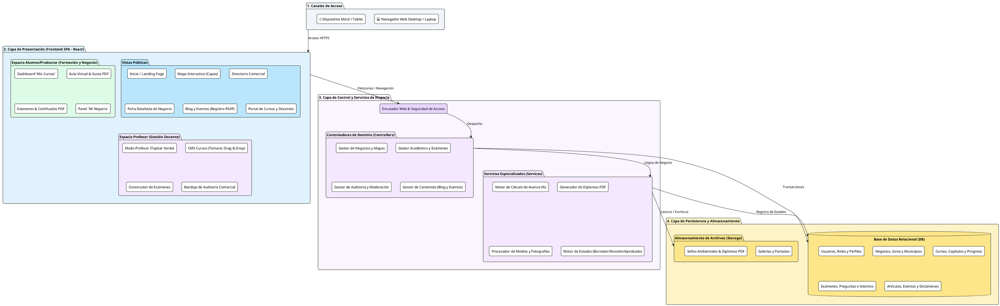
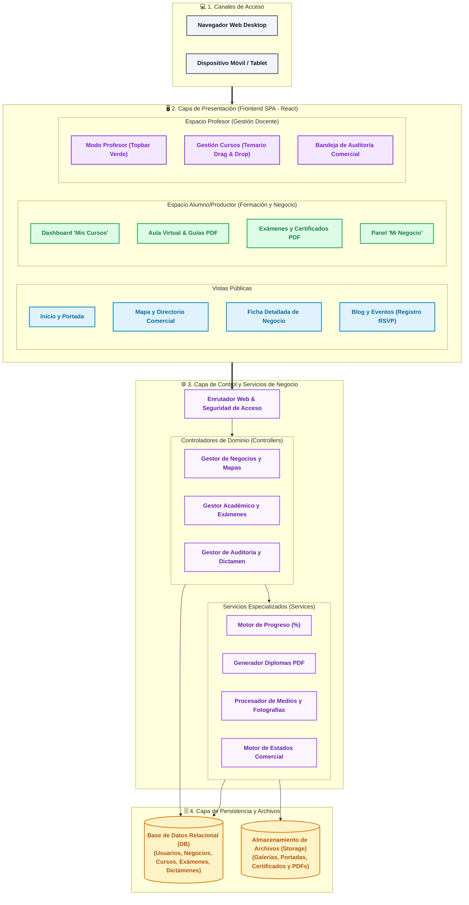

# **Diagrama 2: Arquitectura Conceptual y Modular de la Plataforma**

Este diagrama modela la arquitectura en capas del sistema con palabras clave breves, diseño sin cruces de líneas y una paleta de colores ordenada para distinguir claramente cada nivel tecnológico.

---

## **1. Glosario de Abreviaturas y Términos Técnicos**

Para facilitar la lectura y evaluación del diagrama, a continuación se describe el significado de cada abreviatura empleada:

| Abreviatura / Término | Significado Completo | Descripción en la Plataforma |
| :--- | :--- | :--- |
| **SPA** | **Aplicación Web de Página Única** (*Single Page Application*) | Arquitectura frontend reactiva (React) que actualiza las vistas instantáneamente sin recargar la página. |
| **UI** | **Interfaz de Usuario** (*User Interface*) | Conjunto de pantallas, botones, formularios y componentes visuales que interactúan con el usuario. |
| **HTTPS** | **Protocolo Seguro de Navegación** (*Hypertext Transfer Protocol Secure*) | Canal seguro y cifrado de comunicación entre los navegadores y el servidor. |
| **LMS** | **Sistema de Gestión de Aprendizaje** (*Learning Management System*) | Capa académica: Cursos, aula virtual, exámenes y emisión de certificados. |
| **CMS** | **Sistema de Gestión de Contenidos** (*Content Management System*) | Capa editorial: Creación de noticias, guías y agenda de eventos. |
| **RSVP** | **Confirmación de Asistencia** (*Répondez s'il vous plaît*) | Módulo de registro para apartar lugar en eventos de la Reserva. |
| **PDF** | **Documento Digital** (*Portable Document Format*) | Archivos descargables de diplomas de acreditación y manuales de apoyo. |
| **Ctrls / Controllers** | **Controladores de Dominio** | Componentes de software que reciben las peticiones de las vistas y ejecutan las acciones solicitadas. |
| **Servs / Services** | **Servicios de Negocio** | Motores especializados (generador de diplomas, procesador de imágenes, cálculo de progreso). |
| **DB** | **Base de Datos Relacional** (*Database*) | Repositorio estructurado donde se almacenan usuarios, cursos, preguntas, negocios y dictámenes. |
| **Drag & Drop** | **Arrastrar y Soltar** | Interfaz táctil y de ratón para ordenar los capítulos del temario. |

---

## **2. Convención de Colores por Capa**

* ⬜ **Capa 1: Canales de Acceso (Gris Slate):** Dispositivos móviles, tablets y navegadores de escritorio.
* 🟦 **Capa 2: Presentación / Frontend (Azul y Verde):** Interfaces públicas (Visitante), panel privado (Alumno/Productor) y espacio docente (Profesor).
* 🟪 **Capa 3: Control y Servicios (Púrpura):** Enrutamiento, controladores de dominio y motores de lógica de negocio.
* 🟧 **Capa 4: Persistencia y Almacenamiento (Ámbar / Naranja):** Base de datos relacional y repositorio de archivos multimedia.

---

## **3. Versión en PlantUML (Compatible con [plantuml.com](https://www.plantuml.com/plantuml/uml/))**

> **Instrucciones:** Copia el siguiente código y pégalo en [https://www.plantuml.com/plantuml/uml/](https://www.plantuml.com/plantuml/uml/) para visualizarlo con colores y formato vectorial.

---

## **4. Versión en Mermaid (Renderizado Directo con Colores)**

