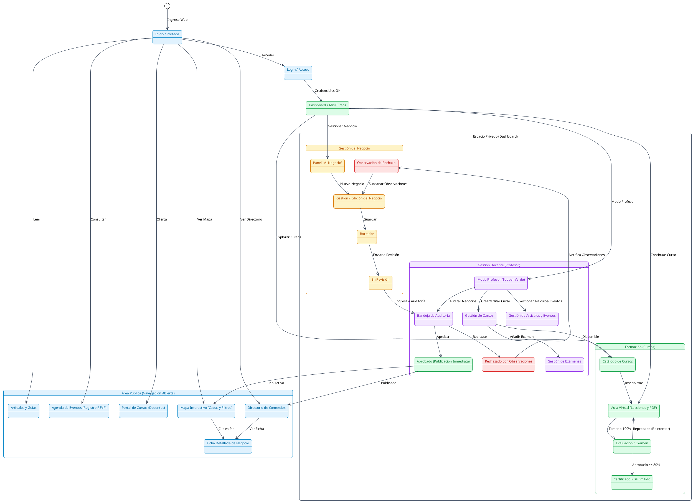
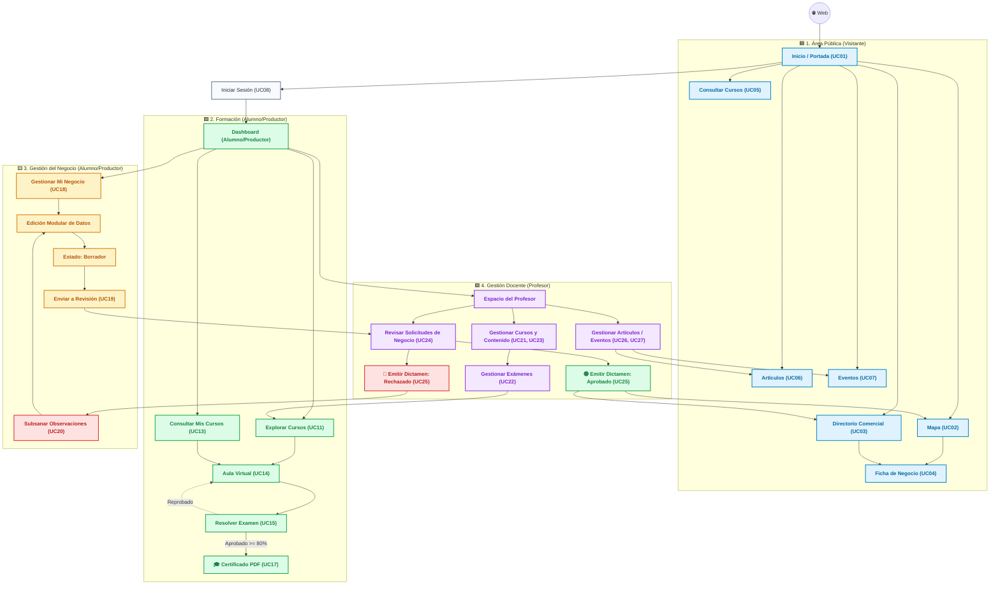

# **Diagrama 3: Comportamiento de Rutas y Ciclo de Estados**

Este diagrama modela el flujo de navegación integral de la plataforma, el ciclo de formación del Alumno/Productor y el ciclo de vida de los registros de negocio con palabras clave concisas, diseño ordenado sin cruce de líneas y diferenciación cromática por módulo.

---

## **1. Glosario de Abreviaturas y Términos Utilizados**

Para facilitar la lectura y evaluación del diagrama, a continuación se describe el significado de cada término empleado:

| Abreviatura / Término | Significado Completo | Descripción en la Plataforma |
| :--- | :--- | :--- |
| **Formación (LMS)** | **Sistema de Gestión de Aprendizaje** (*Learning Management System*) | Flujo educativo: Catálogo de cursos, aula virtual, exámenes y certificados oficiales. |
| **CMS** | **Sistema de Gestión de Contenidos** (*Content Management System*) | Flujo editorial: Publicación de artículos, guías ecológicas y eventos institucionales. |
| **RSVP** | **Enlace de Registro Externo** (*Répondez s'il vous plaît*) | Botón de enlace provisto por el organizador para confirmar asistencia externa a un evento. |
| **PDF** | **Documento Digital Descargable** (*Portable Document Format*) | Formato de los certificados oficiales y de las guías de estudio descargables. |
| **Gestión del Negocio** | **Padrón Comercial Propio** | Módulo donde el Alumno/Productor registra, edita su negocio, envía a revisión y subsana observaciones. |
| **Dictamen** | **Resolución del Profesor** | Decisión formal de **Aprobar** (publicar) o **Rechazar con observaciones**. |
| **Subsanación** | **Corrección de Observaciones** | Proceso donde el usuario solventa los datos señalados por el Profesor y reenvía su solicitud. |

---

## **2. Paleta de Colores y Convenciones**

* 🟦 **Área Pública (Azul):** Navegación libre, mapas, directorios, artículos y eventos (Visitante).
* 🟩 **Formación (Verde):** Cursos, aula virtual, exámenes y certificado (Alumno/Productor).
* 🟨 **Gestión del Negocio (Ámbar):** Registro, edición, estados de trámite y subsanación (Alumno/Productor).
* 🟪 **Gestión Docente (Púrpura):** Auditoría comercial, dictámenes y creación de cursos (Profesor).
* 🟥 **Alertas y Rechazos (Rojo):** Notificación de observaciones y subsanación.

---

## **3. Versión en PlantUML (Compatible con [plantuml.com](https://www.plantuml.com/plantuml/uml/))**

> **Instrucciones:** Copia el siguiente código y pégalo en [https://www.plantuml.com/plantuml/uml/](https://www.plantuml.com/plantuml/uml/) para visualizarlo con colores y formato vectorial.

---

## **4. Versión en Mermaid (Renderizado Directo con Colores y Rutas Claras)**

