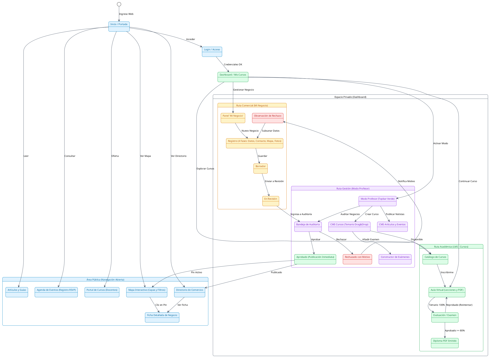
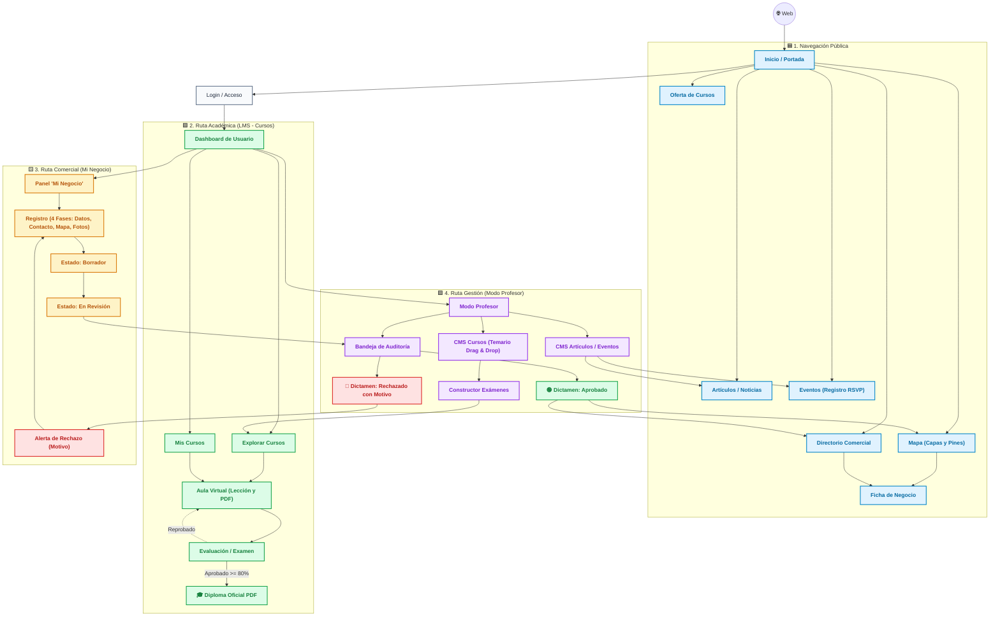

# **Diagrama 3: Comportamiento de Rutas y Ciclo de Estados**

Este diagrama modela el flujo de navegación integral de la plataforma, el ciclo de formación del estudiante y el ciclo de vida de los registros comerciales con palabras clave concisas, diseño ordenado sin cruce de líneas y diferenciación cromática por módulo.

---

## **1. Glosario de Abreviaturas y Términos Utilizados**

Para facilitar la lectura y evaluación del diagrama, a continuación se describe el significado de cada abreviatura empleada:

| Abreviatura / Término | Significado Completo | Descripción en la Plataforma |
| :--- | :--- | :--- |
| **LMS** | **Sistema de Gestión de Aprendizaje** (*Learning Management System*) | Flujo educativo: Catálogo de cursos, aula virtual, exámenes y diplomas oficiales. |
| **CMS** | **Sistema de Gestión de Contenidos** (*Content Management System*) | Flujo editorial: Publicación de noticias, guías ecológicas y eventos institucionales. |
| **RSVP** | **Registro / Confirmación de Asistencia** (*Répondez s'il vous plaît*) | Formulario o botón para asegurar asistencia a un evento presencial o virtual. |
| **PDF** | **Documento Digital Descargable** (*Portable Document Format*) | Formato de los diplomas oficiales y de las guías de estudio descargables. |
| **Drag & Drop** | **Arrastrar y Soltar** | Mecanismo interactivo para reordenar capítulos y exámenes en el temario docente. |
| **Mi Negocio (Trade)** | **Padrón Comercial Propio** | Módulo donde el emprendedor registra su comercio a través de 4 fases asistidas. |
| **Dictamen** | **Resolución del Moderador** | Decisión administrativa formal de **Aprobar** (publicar) o **Rechazar con motivo**. |
| **Subsanación** | **Corrección de Observaciones** | Proceso donde el usuario corrige los datos señalados por el evaluador y reenvía su trámite. |

---

## **2. Paleta de Colores y Convenciones**

* 🟦 **Área Pública (Azul):** Navegación libre, mapas, directorios, artículos y eventos.
* 🟩 **Área Académica / LMS (Verde):** Cursos, aula virtual, exámenes y diplomas.
* 🟨 **Área Comercial / Mi Negocio (Ámbar):** Registro en 4 fases, estados de trámite y subsanación.
* 🟪 **Área de Gestión / Moderación (Púrpura):** Auditoría comercial, dictámenes y creación de cursos.
* 🟥 **Alertas y Rechazos (Rojo):** Devolución con motivo obligatorio y corrección.

---

## **3. Versión en PlantUML (Compatible con [plantuml.com](https://www.plantuml.com/plantuml/uml/))**

> **Instrucciones:** Copia el siguiente código y pégalo en [https://www.plantuml.com/plantuml/uml/](https://www.plantuml.com/plantuml/uml/) para visualizarlo con colores y formato vectorial.

---

## **4. Versión en Mermaid (Renderizado Directo con Colores y Rutas Claras)**

