# **Diagrama 4: Arquitectura de la Información (Estructura Jerárquica)**

Este diagrama modela la **Arquitectura de la Información (AI)** de la plataforma web mediante una estructura jerárquica y modular, organizando todos los módulos, pantallas, secciones y componentes funcionales descritos en el alcance y alineados con los 29 casos de uso oficiales.

---

## **1. Glosario de Términos y Convenciones**

| Término | Definición en la Arquitectura de la Información |
| :--- | :--- |
| **Frontera del Sistema (Raíz)** | Plataforma Web de la Reserva de la Biosfera Tehuacán-Cuicatlán. |
| **Nivel 2 (Grupos Funcionales)** | Las 6 agrupaciones del sistema: Área Pública, Formación, Gestión del Negocio, Contenido del Usuario, Perfil de Usuario y Gestión Docente. |
| **Nivel 3 (Vistas / Pantallas)** | Páginas principales a las que puede acceder el usuario según su rol (**Visitante**, **Alumno/Productor**, **Profesor**). |
| **Nivel 4 (Secciones / Componentes)** | Bloques de contenido, formularios y componentes visuales específicos dentro de cada pantalla. |
| **Certificado PDF** | Documento descargable generado automáticamente tras completar el 100% de los capítulos y aprobar las evaluaciones. |
| **RSVP** | Enlace externo a la plataforma de registro/boletos provisto por el organizador del evento. |

---

## **2. Versión en PlantUML (Árbol Jerárquico WBS / plantuml.com)**

> **Instrucciones:** Copia el siguiente código y pégalo en [https://www.plantuml.com/plantuml/uml/](https://www.plantuml.com/plantuml/uml/) para generar la estructura jerárquica en alta resolución.

```plantuml
@startwbs
!theme plain
skinparam roundcorner 8
skinparam shadowing false
skinparam defaultFontName sans-serif

<style>
wbsDiagram {
  .root {
    BackgroundColor #0F172A
    FontColor White
    FontStyle bold
    RoundCorner 10
  }
  .publico {
    BackgroundColor #E0F2FE
    LineColor #0284C7
    FontColor #0369A1
    FontStyle bold
  }
  .lms {
    BackgroundColor #DCFCE7
    LineColor #16A34A
    FontColor #15803D
    FontStyle bold
  }
  .trade {
    BackgroundColor #FEF3C7
    LineColor #D97706
    FontColor #B45309
    FontStyle bold
  }
  .usercontent {
    BackgroundColor #F1F5F9
    LineColor #64748B
    FontColor #334155
    FontStyle bold
  }
  .perfil {
    BackgroundColor #E2E8F0
    LineColor #475569
    FontColor #1E293B
    FontStyle bold
  }
  .admin {
    BackgroundColor #F3E8FF
    LineColor #9333EA
    FontColor #7E22CE
    FontStyle bold
  }
}
</style>

* **Plataforma Web Reserva Tehuacán-Cuicatlán** <<root>>

** **1. Área Pública (Visitante)** <<publico>>
*** **1.1. Inicio (UC01)**
**** Hero Carrusel y postales
**** Cintillo de novedades
**** Conócenos y Rutas
*** **1.2. Mapa Interactivo (UC02)**
**** Polígono de la Reserva y municipios
**** Marcadores georreferenciados de negocios
**** Ficha rápida lateral
*** **1.3. Directorio Comercial (UC03)**
**** Buscador y filtros paramétricos
**** Cuadrícula de comercios aprobados
*** **1.4. Detalle de Negocio (UC04)**
**** Portada, contacto y horarios
**** Galería y sellos ambientales
**** Ubicación geográfica
*** **1.5. Cursos Públicos (UC05)**
**** Catálogo formativo introductorio
*** **1.6. Artículos y Enlaces (UC06)**
**** Lector de contenido y recomendaciones
*** **1.7. Agenda de Eventos (UC07)**
**** Ficha del evento y enlace RSVP externo
*** **1.8. Acceso y Seguridad (UC08, UC09, UC10)**
**** Iniciar sesión (UC08)
**** Registrarse (UC09)
**** Recuperar contraseña (UC10)

** **2. Formación (Alumno/Productor)** <<lms>>
*** **2.1. Explorar Cursos (UC11)**
**** Catálogo general y filtros
*** **2.2. Inscribirse a Curso (UC12)**
**** Inscripción inmediata y gratuita
*** **2.3. Consultar Mis Cursos (UC13)**
**** Cursos en progreso y completados
*** **2.4. Aula Virtual (UC14)**
**** Temario lateral interactivo
**** Visor multimedia y guías PDF
**** Marcado de progreso de capítulos
*** **2.5. Evaluaciones y Certificación (UC15, UC16, UC17)**
**** Resolver examen (UC15)
**** Consultar resultados y retroalimentación (UC16)
**** Descargar certificado oficial en PDF (UC17)

** **3. Gestión del Negocio (Alumno/Productor)** <<trade>>
*** **3.1. Gestionar Mi Negocio (UC18)**
**** Panel de establecimientos propios
**** Registro y edición modular (Datos, Contacto, Mapa, Fotos, Sellos)
*** **3.2. Enviar Solicitud a Revisión (UC19)**
**** Validación y cambio a estado 'En Revisión'
*** **3.3. Subsanar Observaciones (UC20)**
**** Visualización de motivo de rechazo emitido
**** Edición y reenvío del expediente

** **4. Contenido del Usuario (Alumno/Productor)** <<usercontent>>
*** **4.1. Consultar Enlaces de Interés (UC29)**
**** Acceso interno a artículos y eventos (/discover)

** **5. Perfil de Usuario (Alumno/Productor, Profesor)** <<perfil>>
*** **5.1. Configurar Perfil (UC28)**
**** Actualización de nombre y correo
**** Cambio de contraseña
**** Eliminación de cuenta

** **6. Gestión Docente (Profesor)** <<admin>>
*** **6.1. Gestión de Cursos (UC21)**
**** Listado, creación y publicación de cursos
*** **6.2. Gestión de Exámenes (UC22)**
**** Constructor de pruebas y banco de preguntas
*** **6.3. Gestión de Contenido de Cursos (UC23)**
**** Temario, capítulos interactivos y PDFs adjuntos
*** **6.4. Revisión de Solicitudes de Negocio (UC24)**
**** Bandeja de auditoría y expediente digital
*** **6.5. Emisión de Dictamen (UC25 - include)**
**** Aprobación o rechazo con observaciones obligatorias
*** **6.6. Gestión de Artículos (UC26)**
**** Redacción y publicación de contenidos editoriales
*** **6.7. Gestión de Eventos (UC27)**
**** Creación y publicación de eventos con ponentes

@endwbs
```

---

## **3. Versión en Mermaid (Diagrama Jerárquico con Colores)**

```mermaid
flowchart TD
    %% ESTILOS DE COLOR
    classDef root fill:#0f172a,stroke:#334155,stroke-width:2px,color:#ffffff,font-weight:bold;
    classDef pub fill:#e0f2fe,stroke:#0284c7,stroke-width:2px,color:#0369a1,font-weight:bold;
    classDef lms fill:#dcfce7,stroke:#16a34a,stroke-width:2px,color:#15803d,font-weight:bold;
    classDef trade fill:#fef3c7,stroke:#d97706,stroke-width:2px,color:#b45309,font-weight:bold;
    classDef usercont fill:#f1f5f9,stroke:#64748b,stroke-width:2px,color:#334155,font-weight:bold;
    classDef perfil fill:#e2e8f0,stroke:#475569,stroke-width:2px,color:#1e293b,font-weight:bold;
    classDef admin fill:#f3e8ff,stroke:#9333ea,stroke-width:2px,color:#7e22ce,font-weight:bold;
    classDef subNode fill:#ffffff,stroke:#94a3b8,stroke-width:1px,color:#1e293b;

    %% NODO RAÍZ
    ROOT["🌐 Plataforma Web de la Reserva de la Biosfera Tehuacán-Cuicatlán"]:::root

    %% NIVEL 2: 6 GRUPOS FUNCIONALES
    ROOT --> M_PUB["🟦 1. Área Pública (Visitante)"]:::pub
    ROOT --> M_LMS["🟩 2. Formación (Alumno/Productor)"]:::lms
    ROOT --> M_TRADE["🟨 3. Gestión del Negocio (Alumno/Productor)"]:::trade
    ROOT --> M_CONT["📄 4. Contenido del Usuario"]:::usercont
    ROOT --> M_PERF["👤 5. Perfil de Usuario"]:::perfil
    ROOT --> M_ADMIN["🟪 6. Gestión Docente (Profesor)"]:::admin

    %% NIVEL 3 & 4: 1. ÁREA PÚBLICA
    subgraph S_PUB["Estructura del Área Pública"]
        M_PUB --> P1["1.1. Inicio (UC01)"]:::pub
        M_PUB --> P2["1.2. Mapa Interactivo (UC02)"]:::pub
        M_PUB --> P3["1.3. Directorio Comercial (UC03)"]:::pub
        M_PUB --> P4["1.4. Detalle de Negocio (UC04)"]:::pub
        M_PUB --> P5["1.5. Cursos Públicos (UC05)"]:::pub
        M_PUB --> P6["1.6. Artículos (UC06)"]:::pub
        M_PUB --> P7["1.7. Eventos (UC07)"]:::pub
        M_PUB --> P8["1.8. Acceso y Registro (UC08-UC10)"]:::pub
    end

    %% NIVEL 3 & 4: 2. FORMACIÓN
    subgraph S_LMS["Estructura de Formación"]
        M_LMS --> L1["2.1. Explorar Cursos (UC11)"]:::lms
        M_LMS --> L2["2.2. Inscribirse a Curso (UC12)"]:::lms
        M_LMS --> L3["2.3. Consultar Mis Cursos (UC13)"]:::lms
        M_LMS --> L4["2.4. Aula Virtual (UC14)"]:::lms
        M_LMS --> L5["2.5. Evaluaciones (UC15, UC16)"]:::lms
        M_LMS --> L6["2.6. Descargar Certificado (UC17)"]:::lms
    end

    %% NIVEL 3 & 4: 3. GESTIÓN DEL NEGOCIO
    subgraph S_TRADE["Estructura de Gestión del Negocio"]
        M_TRADE --> T1["3.1. Gestionar Mi Negocio (UC18)"]:::trade
        M_TRADE --> T2["3.2. Enviar Solicitud a Revisión (UC19)"]:::trade
        M_TRADE --> T3["3.3. Subsanar Observaciones (UC20)"]:::trade
    end

    %% NIVEL 3 & 4: 4 & 5. CONTENIDO Y PERFIL
    subgraph S_USER["Contenido y Perfil"]
        M_CONT --> C1["4.1. Consultar Enlaces de Interés (UC29)"]:::usercont
        M_PERF --> U1["5.1. Configurar Perfil (UC28)"]:::perfil
    end

    %% NIVEL 3 & 4: 6. GESTIÓN DOCENTE
    subgraph S_ADMIN["Estructura de Gestión Docente"]
        M_ADMIN --> G1["6.1. Gestionar Cursos (UC21)"]:::admin
        M_ADMIN --> G2["6.2. Gestionar Exámenes (UC22)"]:::admin
        M_ADMIN --> G3["6.3. Gestionar Contenido Cursos (UC23)"]:::admin
        M_ADMIN --> G4["6.4. Revisar Solicitudes de Negocio (UC24)"]:::admin
        M_ADMIN --> G5["6.5. Emitir Dictamen (UC25)"]:::admin
        M_ADMIN --> G6["6.6. Gestionar Artículos (UC26)"]:::admin
        M_ADMIN --> G7["6.7. Gestionar Eventos (UC27)"]:::admin
    end
```

---

## **4. Desglose de Secciones por Nivel Jerárquico**

A continuación se detalla la navegación de contenidos de cada grupo funcional:

1. **Área Pública (Visitante - UC01 al UC10):**
   * **Inicio (UC01):** Hero carrusel -> cintillo de novedades -> rutas -> conócenos.
   * **Mapa (UC02):** Lienzo cartográfico -> filtros por capas y giros -> marcadores georreferenciados -> ficha rápida lateral.
   * **Directorio Comercial (UC03):** Buscador -> filtros por giro y municipio -> cuadrícula de negocios aprobados.
   * **Detalle de Negocio (UC04):** Portada -> contacto -> servicios y amenidades -> galería fotográfica -> sellos ambientales -> localización.
   * **Cursos Públicos (UC05):** Catálogo de oferta formativa comunitaria.
   * **Artículos (UC06):** Lector de notas y guías ecológicas con lecturas sugeridas.
   * **Eventos (UC07):** Agenda comunitaria con ponentes y enlace de registro externo (RSVP).
   * **Acceso y Registro (UC08, UC09, UC10):** Formularios de login, registro de cuenta y recuperación de clave.

2. **Formación (Alumno/Productor - UC11 al UC17):**
   * **Explorar e Inscribirse (UC11, UC12):** Buscador interno y catálogo para inscripción directa y gratuita.
   * **Mis Cursos (UC13):** Monitoreo de cursos activos con barra de avance (%) y cursos terminados.
   * **Aula Virtual (UC14):** Temario interactivo, reproducción de video, lecturas y guías PDF descargables.
   * **Evaluaciones y Certificación (UC15, UC16, UC17):** Resolución de exámenes de opción múltiple, cálculo inmediato de calificación y retroalimentación, y descarga del certificado oficial en PDF.

3. **Gestión del Negocio (Alumno/Productor - UC18 al UC20):**
   * **Gestión Integral (UC18):** Tablero de establecimientos propios y formulario modular (datos generales, contacto, coordenadas en mapa, fotos y certificados).
   * **Envío a Revisión (UC19):** Postulación de la solicitud para auditoría por parte del Profesor.
   * **Subsanación (UC20):** Recepción de observaciones detalladas y reenvío tras solventar inconsistencias.

4. **Contenido del Usuario (Alumno/Productor - UC29):**
   * **Enlaces de Interés (UC29):** Hub privado (`/discover`) para consultar artículos y cartelera de eventos.

5. **Perfil de Usuario (Alumno/Productor, Profesor - UC28):**
   * **Configuración Personal (UC28):** Actualización de nombre, correo, cambio de credenciales y eliminación de cuenta.

6. **Gestión Docente (Profesor - UC21 al UC27):**
   * **Cursos, Exámenes y Contenido (UC21, UC22, UC23):** Creación pedagógica, temarios interactivos, subida de contenidos y diseño de evaluaciones.
   * **Auditoría y Dictamen Comercial (UC24, UC25):** Bandeja de solicitudes, expediente digital de verificación y dictamen formal (aprobación con publicación automática o rechazo con observaciones obligatorias).
   * **Gestión Editorial (UC26, UC27):** Creación y publicación de artículos y eventos con catálogo de ponentes.
