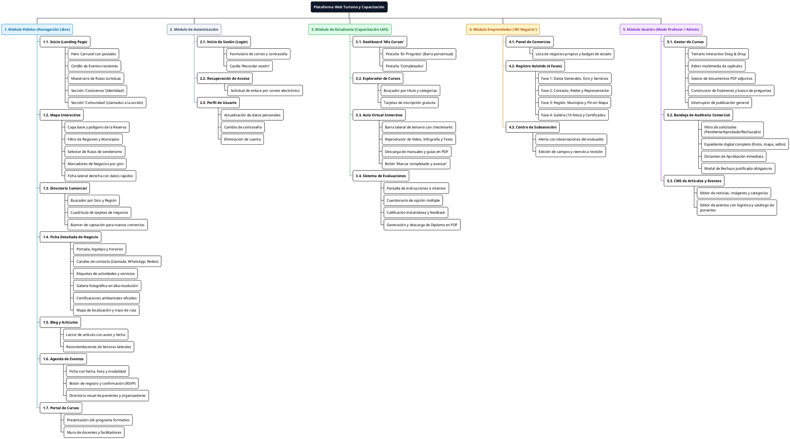

# **Diagrama 4: Arquitectura de la Información (Estructura Jerárquica)**

Este diagrama modela la **Arquitectura de la Información (AI)** de la plataforma web mediante una estructura jerárquica y modular, organizando todos los módulos, pantallas, secciones y componentes funcionales descritos en el alcance.

---

## **1. Glosario de Términos y Convenciones**

| Término | Definición en la Arquitectura de la Información |
| :--- | :--- |
| **Nivel 1 (Raíz)** | Ecosistema global de la plataforma web. |
| **Nivel 2 (Módulos)** | Grandes áreas funcionales (Pública, Autenticación, Estudiante, Emprendedor y Gestión Docente). |
| **Nivel 3 (Vistas / Pantallas)** | Páginas principales a las que puede acceder el usuario. |
| **Nivel 4 (Secciones / Componentes)** | Bloques de contenido, formularios y componentes visuales específicos dentro de cada pantalla. |
| **LMS** | Módulo de Capacitación y Gestión de Aprendizaje (*Learning Management System*). |
| **CMS** | Módulo de Gestión de Contenidos Editoriales (*Content Management System*). |
| **RSVP** | Registro y confirmación de asistencia a eventos. |
| **PDF** | Documento descargable de diplomas oficiales o guías pedagógicas. |

---

## **2. Versión en PlantUML (Árbol Jerárquico WBS / plantuml.com)**

> **Instrucciones:** Copia el siguiente código y pégalo en [https://www.plantuml.com/plantuml/uml/](https://www.plantuml.com/plantuml/uml/) para generar la estructura jerárquica en alta resolución.

---

## **3. Versión en Mermaid (Diagrama Jerárquico con Colores)**

```mermaid
flowchart TD
    %% ESTILOS DE COLOR
    classDef root fill:#0f172a,stroke:#334155,stroke-width:2px,color:#ffffff,font-weight:bold;
    classDef pub fill:#e0f2fe,stroke:#0284c7,stroke-width:2px,color:#0369a1,font-weight:bold;
    classDef auth fill:#f1f5f9,stroke:#64748b,stroke-width:2px,color:#334155,font-weight:bold;
    classDef lms fill:#dcfce7,stroke:#16a34a,stroke-width:2px,color:#15803d,font-weight:bold;
    classDef trade fill:#fef3c7,stroke:#d97706,stroke-width:2px,color:#b45309,font-weight:bold;
    classDef admin fill:#f3e8ff,stroke:#9333ea,stroke-width:2px,color:#7e22ce,font-weight:bold;
    classDef subNode fill:#ffffff,stroke:#94a3b8,stroke-width:1px,color:#1e293b;

    %% NODO RAÍZ
    ROOT["🌐 Plataforma Web de Turismo, Conservación y Capacitación"]:::root

    %% NIVEL 2: MÓDULOS
    ROOT --> M_PUB["🟦 1. Módulo Público"]:::pub
    ROOT --> M_AUTH["🔒 2. Módulo de Autenticación"]:::auth
    ROOT --> M_LMS["🟩 3. Módulo Estudiante (LMS)"]:::lms
    ROOT --> M_TRADE["🟨 4. Módulo Emprendedor (Mi Negocio)"]:::trade
    ROOT --> M_ADMIN["🟪 5. Módulo Gestión (Modo Profesor)"]:::admin

    %% NIVEL 3 & 4: 1. PÚBLICO
    subgraph S_PUB["Estructura del Área Pública"]
        M_PUB --> P1["1.1. Inicio / Landing Page"]:::pub
        P1 --- P1_1["• Hero Carrusel\n• Rutas y Eventos\n• Conócenos & CTA"]:::subNode

        M_PUB --> P2["1.2. Mapa Interactivo"]:::pub
        P2 --- P2_1["• Capa Base Reserva\n• Filtro Regiones/Municipios\n• Pines de Negocios y Ficha"]:::subNode

        M_PUB --> P3["1.3. Directorio Comercial"]:::pub
        P3 --- P3_1["• Buscador por Giro/Región\n• Cuadrícula de Tarjetas\n• Registro de Negocio"]:::subNode

        M_PUB --> P4["1.4. Ficha de Negocio"]:::pub
        P4 --- P4_1["• Portada y Contacto\n• Servicios y Galería\n• Certificados y Mapa"]:::subNode

        M_PUB --> P5["1.5. Blog y Eventos"]:::pub
        P5 --- P5_1["• Lector de Artículos\n• Agenda y Registro RSVP\n• Directorio de Ponentes"]:::subNode
    end

    %% NIVEL 3 & 4: 2. AUTENTICACIÓN
    subgraph S_AUTH["Estructura de Autenticación"]
        M_AUTH --> A1["2.1. Acceso (Login)"]:::auth
        M_AUTH --> A2["2.2. Recuperación"]:::auth
        M_AUTH --> A3["2.3. Perfil de Usuario"]:::auth
        A3 --- A3_1["• Datos personales\n• Cambio Password\n• Eliminar cuenta"]:::subNode
    end

    %% NIVEL 3 & 4: 3. LMS ESTUDIANTE
    subgraph S_LMS["Estructura Académica (Estudiante)"]
        M_LMS --> L1["3.1. Dashboard 'Mis Cursos'"]:::lms
        L1 --- L1_1["• En Progreso (% avance)\n• Cursos Completados"]:::subNode

        M_LMS --> L2["3.2. Explorar Cursos"]:::lms
        L2 --- L2_1["• Filtros por Categoría\n• Inscripción Gratuita"]:::subNode

        M_LMS --> L3["3.3. Aula Virtual"]:::lms
        L3 --- L3_1["• Temario lateral interactivo\n• Video, Texto y Guías PDF\n• Marcar completado"]:::subNode

        M_LMS --> L4["3.4. Exámenes y Diplomas"]:::lms
        L4 --- L4_1["• Test de Opción Múltiple\n• Calificación e Intentos\n• 🎓 Diploma PDF"]:::subNode
    end

    %% NIVEL 3 & 4: 4. EMPRENDEDOR
    subgraph S_TRADE["Estructura Comercial (Emprendedor)"]
        M_TRADE --> T1["4.1. Panel 'Mi Negocio'"]:::trade
        T1 --- T1_1["• Padrón propio y Estados"]:::subNode

        M_TRADE --> T2["4.2. Registro en 4 Fases"]:::trade
        T2 --- T2_1["• F1: Datos Generales\n• F2: Contacto y Redes\n• F3: Ubicación y Pin Mapa\n• F4: Galería y Sellos"]:::subNode

        M_TRADE --> T3["4.3. Centro de Subsanación"]:::trade
        T3 --- T3_1["• Alerta con motivo de rechazo\n• Corrección y reenvío"]:::subNode
    end

    %% NIVEL 3 & 4: 5. GESTIÓN PROFESOR
    subgraph S_ADMIN["Estructura de Gestión (Modo Profesor)"]
        M_ADMIN --> G1["5.1. CMS Cursos"]:::admin
        G1 --- G1_1["• Temario Drag & Drop\n• Editor de Capítulos y PDFs\n• Constructor de Exámenes\n• Publicación de Curso"]:::subNode

        M_ADMIN --> G2["5.2. Bandeja de Auditoría"]:::admin
        G2 --- G2_1["• Expediente del negocio\n• Dictamen: Aprobar\n• Dictamen: Rechazo justificado"]:::subNode

        M_ADMIN --> G3["5.3. CMS Artículos y Eventos"]:::admin
        G3 --- G3_1["• Editor de noticias\n• Agenda y Elenco de Ponentes"]:::subNode
    end
```

---

## **4. Desglose de Secciones por Nivel Jerárquico**

A continuación se detalla la navegación de contenidos de cada módulo:

1. **Módulo Público:**
   * **Inicio:** Hero -> Eventos -> Rutas -> Conócenos -> Comunidad.
   * **Mapa:** Lienzo interactivo -> Controles de capas -> Pines de giros -> Ficha rápida lateral.
   * **Directorio:** Buscador -> Filtros de Giro/Región -> Cuadrícula de negocios -> Botón a ficha.
   * **Ficha de Negocio:** Encabezado -> Contacto multicanal -> Servicios -> Galería -> Certificaciones -> Localización.
   * **Blog y Eventos:** Catálogo -> Lector con recomendaciones -> Evento con RSVP y lista de ponentes.
2. **Módulo de Autenticación:**
   * Login -> Recordar credenciales -> Recuperar contraseña -> Perfil de usuario.
3. **Módulo de Estudiante (LMS):**
   * Dashboard -> Explorador -> Aula virtual con lecciones y PDFs -> Examen con calificación -> Emisión de Diploma PDF.
4. **Módulo de Emprendedor ("Mi Negocio"):**
   * Panel de establecimientos -> Asistente de 4 fases -> Guardado en borrador -> Envío a revisión -> Alerta de subsanación.
5. **Módulo de Gestión (Modo Profesor):**
   * Barra superior verde -> CMS de cursos (Drag & Drop) -> Constructor de exámenes -> Auditoría de negocios (Aprobar / Rechazar) -> CMS editorial.
