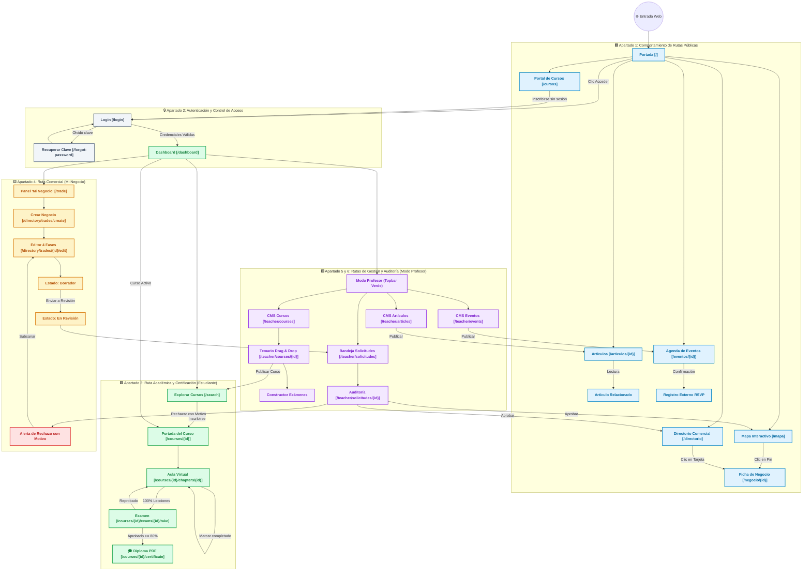

# **Diagrama 5: Comportamiento de Rutas por Apartado y Flujo de Navegación**

Este documento detalla el **comportamiento de rutas, transiciones de pantalla, intercepción de seguridad y navegación interactiva de cada apartado** de la plataforma web, asociando cada acción con su pantalla y su estado resultante.

---

## **1. Glosario de Rutas y Términos por Apartado**

| Apartado | Ruta / Pantalla | Acción del Usuario | Comportamiento / Resultado |
| :--- | :--- | :--- | :--- |
| **Público** | `/` (Inicio) | Clic en navegación o botones | Dirige a Mapa, Directorio, Artículos, Eventos o Cursos. |
| **Público** | `/mapa` (Mapa) | Clic en Marcador geográfico | Despliega popup y abre ficha rápida lateral con botón a `/negocio/{id}`. |
| **Público** | `/directorio` | Filtrar por Giro / Región | Actualiza cuadrícula y navega a `/negocio/{id}`. |
| **Público** | `/negocio/{id}` | Consultar perfil comercial | Muestra galería, contacto, sellos y mapa con trazo de ruta. |
| **Público** | `/articulos/{id}` | Lectura de artículo | Carga contenido y permite saltar a artículos relacionados. |
| **Público** | `/eventos/{id}` | Consultar evento | Muestra cartelera, ponentes y enlace externo de registro (RSVP). |
| **Seguridad** | `/login` | Ingreso de credenciales | Si es válido redirige a `/dashboard`; si olvida contraseña va a `/forgot-password`. |
| **Seguridad** | *Ruta Protegida* | Intento de acceso sin sesión | Intercepción automática y redirección forzada a `/login`. |
| **Estudiante** | `/dashboard` | Clic en curso activo | Accede a la portada del curso (`/courses/{id}`). |
| **Estudiante** | `/search` | Explorar catálogo de cursos | Inscribirse gratuitamente y comenzar lecciones. |
| **Estudiante** | `/courses/{id}/chapters/{id}` | Estudiar lección | Consume video/texto/PDF y al marcar completado actualiza el avance (%). |
| **Estudiante** | `/courses/{id}/exams/{id}/take` | Resolver examen | Envía respuestas; si aprueba (>=80%) habilita `/certificate` (Diploma PDF). |
| **Emprendedor** | `/trade` | Clic 'Nuevo Negocio' | Inicia formulario de 4 fases y guarda en estado `Borrador`. |
| **Emprendedor** | `/directory/trades/{id}/edit` | Clic 'Enviar a Revisión' | Cambia a `En Revisión` y bloquea edición hasta dictamen. |
| **Emprendedor** | `/trade` (Rechazado) | Clic 'Subsanar' | Despliega alerta con motivo del rechazo, edita datos y reenvía. |
| **Profesor** | `/teacher/courses` | Crear / Editar Curso | Constructor con temario *Drag & Drop*, capítulos multimedia y exámenes. |
| **Moderador** | `/teacher/solicitudes/{id}` | Auditar negocio | **Aprobar** (publica en mapa/directorio) o **Rechazar** (obliga a redactar motivo). |
| **CMS** | `/teacher/articles` / `/events` | Redactar y publicar | Publica artículos y eventos con catálogo de ponentes en el portal público. |

---

## **2. Convención de Colores por Apartado**

* 🟦 **Apartado 1: Rutas Públicas y Territorio (Azul `#0284C7` / `#E0F2FE`)**
* ⬜ **Apartado 2: Rutas de Autenticación y Control de Acceso (Gris `#475569` / `#F1F5F9`)**
* 🟩 **Apartado 3: Rutas de Capacitación y Aprendizaje LMS (Verde `#16A34A` / `#DCFCE7`)**
* 🟨 **Apartado 4: Rutas de Emprendedores y Mi Negocio (Ámbar `#D97706` / `#FEF3C7`)**
* 🟪 **Apartado 5: Rutas de Gestión Docente y Modo Profesor (Púrpura `#9333EA` / `#F3E8FF`)**
* 🟥 **Apartado 6: Rutas de Auditoría, Dictamen y Subsanación (Rojo `#DC2626` / `#FEE2E2`)**

---

## **3. Versión en PlantUML (Compatible con [plantuml.com](https://www.plantuml.com/plantuml/uml/))**

> **Instrucciones:** Copia el siguiente código y pégalo en [https://www.plantuml.com/plantuml/uml/](https://www.plantuml.com/plantuml/uml/) para visualizar el mapa de rutas completo.

```plantuml
@startuml
!theme plain
skinparam state {
  RoundCorner 10
  BorderColor #334155
  BackgroundColor White
}
skinparam ArrowColor #1E293B

' --- COLORES POR APARTADO ---
skinparam state<<Publico>> {
  BackgroundColor #E0F2FE
  BorderColor #0284C7
  FontColor #0369A1
}
skinparam state<<Auth>> {
  BackgroundColor #F1F5F9
  BorderColor #64748B
  FontColor #334155
}
skinparam state<<LMS>> {
  BackgroundColor #DCFCE7
  BorderColor #16A34A
  FontColor #15803D
}
skinparam state<<Trade>> {
  BackgroundColor #FEF3C7
  BorderColor #D97706
  FontColor #B45309
}
skinparam state<<Admin>> {
  BackgroundColor #F3E8FF
  BorderColor #9333EA
  FontColor #7E22CE
}
skinparam state<<Alert>> {
  BackgroundColor #FEE2E2
  BorderColor #DC2626
  FontColor #B91C1C
}

[*] --> R_Inicio : Ingreso a la URL base [/]

' ============================================================
' APARTADO 1: RUTAS PÚBLICAS
' ============================================================
state "Apartado 1: Navegación Pública" as SecPub <<Publico>> {
    state "Portada [/]" as R_Inicio <<Publico>>
    state "Mapa [/mapa]" as R_Mapa <<Publico>>
    state "Directorio [/directorio]" as R_Directorio <<Publico>>
    state "Ficha Negocio [/negocio/{id}]" as R_Negocio <<Publico>>
    state "Artículos [/articulos/{id}]" as R_Articulos <<Publico>>
    state "Eventos [/eventos/{id}]" as R_Eventos <<Publico>>
    state "Portal Cursos [/cursos]" as R_CursosPub <<Publico>>

    R_Inicio --> R_Mapa : Ver Mapa
    R_Inicio --> R_Directorio : Ver Directorio
    R_Inicio --> R_Articulos : Leer Noticias
    R_Inicio --> R_Eventos : Ver Agenda
    R_Inicio --> R_CursosPub : Oferta Formativa

    R_Mapa --> R_Negocio : Clic en Pin -> 'Ver Ficha'
    R_Directorio --> R_Negocio : Clic en Tarjeta
    R_Articulos --> R_Articulos : Clic en Artículo Relacionado
    R_Eventos --> R_Eventos : Clic en Enlace RSVP
}

' ============================================================
' APARTADO 2: AUTENTICACIÓN Y SEGURIDAD
' ============================================================
state "Apartado 2: Control de Acceso" as SecAuth <<Auth>> {
    state "Login [/login]" as R_Login <<Auth>>
    state "Recuperar Contraseña [/forgot-password]" as R_Forgot <<Auth>>
    state "Perfil [/profile]" as R_Profile <<Auth>>

    R_Inicio --> R_Login : Clic 'Acceder'
    R_CursosPub --> R_Login : Si no está autenticado
    R_Login --> R_Forgot : ¿Olvidó clave?
    R_Forgot --> R_Login : Correo enviado
}

R_Login --> R_Dashboard : Credenciales Válidas

' ============================================================
' APARTADO 3: CAPACITACIÓN Y APRENDIZAJE LMS (ESTUDIANTE)
' ============================================================
state "Apartado 3: Ruta Académica (Estudiante LMS)" as SecLMS <<LMS>> {
    state "Dashboard [/dashboard]" as R_Dashboard <<LMS>>
    state "Explorador Cursos [/search]" as R_Search <<LMS>>
    state "Portada Curso [/courses/{id}]" as R_CourseCover <<LMS>>
    state "Aula Virtual [/courses/{id}/chapters/{id}]" as R_Classroom <<LMS>>
    state "Examen [/courses/{id}/exams/{id}/take]" as R_ExamTake <<LMS>>
    state "Diploma PDF [/courses/{id}/certificate]" as R_Cert <<LMS>>

    R_Dashboard --> R_Search : Buscar Cursos
    R_Search --> R_CourseCover : Inscribirse Gratis
    R_Dashboard --> R_CourseCover : Reanudar Curso
    R_CourseCover --> R_Classroom : Iniciar Lección

    R_Classroom --> R_Classroom : Marcar completado -> Siguiente lección
    R_Classroom --> R_ExamTake : Temario al 100%
    R_ExamTake --> R_Classroom : Reprobado (Reintentar)
    R_ExamTake --> R_Cert : Aprobado (>=80%) -> Descarga PDF
}

' ============================================================
' APARTADO 4: MI NEGOCIO (EMPRENDEDOR)
' ============================================================
state "Apartado 4: Ruta Comercial (Mi Negocio)" as SecTrade <<Trade>> {
    state "Padrón Personal [/trade]" as R_TradeList <<Trade>>
    state "Crear Negocio [/directory/trades/create]" as R_TradeCreate <<Trade>>
    state "Editor 4 Fases [/directory/trades/{id}/edit]" as R_TradeEdit <<Trade>>
    state "Estado: Borrador" as ST_Draft <<Trade>>
    state "Estado: En Revisión" as ST_Pending <<Trade>>
    state "Alerta de Rechazo con Motivo" as ST_Rejected <<Alert>>

    R_Dashboard --> R_TradeList : Clic 'Mi Negocio'
    R_TradeList --> R_TradeCreate : Nuevo Registro
    R_TradeCreate --> R_TradeEdit : Nombre básico asignado
    R_TradeEdit --> ST_Draft : Guardar Cambios
    ST_Draft --> ST_Pending : Clic 'Enviar a Revisión'
    ST_Rejected --> R_TradeEdit : Clic 'Subsanar'
}

' ============================================================
' APARTADO 5 Y 6: GESTIÓN DOCENTE Y MODERACIÓN (MODO PROFESOR)
' ============================================================
state "Apartado 5 y 6: Gestión y Moderación" as SecAdmin <<Admin>> {
    state "Modo Profesor (Topbar Verde)" as R_TeacherMode <<Admin>>
    state "CMS Cursos [/teacher/courses]" as R_TeacherCourses <<Admin>>
    state "Editor Temario Drag&Drop [/teacher/courses/{id}]" as R_TeacherCourseEdit <<Admin>>
    state "Editor Exámenes [/teacher/courses/{id}/exams/{id}]" as R_TeacherExams <<Admin>>
    state "Bandeja Solicitudes [/teacher/solicitudes]" as R_Requests <<Admin>>
    state "Auditoría [/teacher/solicitudes/{id}]" as R_RequestShow <<Admin>>
    state "CMS Artículos [/teacher/articles]" as R_TeacherArticles <<Admin>>
    state "CMS Eventos [/teacher/events]" as R_TeacherEvents <<Admin>>

    R_Dashboard --> R_TeacherMode : Activar Modo Profesor
    R_TeacherMode --> R_TeacherCourses : Gestionar Cursos
    R_TeacherCourses --> R_TeacherCourseEdit : Crear / Editar
    R_TeacherCourseEdit --> R_TeacherExams : Añadir Examen
    
    R_TeacherMode --> R_Requests : Moderar Comercios
    R_Requests --> R_RequestShow : Seleccionar Expediente
    
    R_TeacherMode --> R_TeacherArticles : Redactar Noticias
    R_TeacherMode --> R_TeacherEvents : Programar Eventos
}

' --- TRANSICIONES Y CIERRE DE CICLOS ---
ST_Pending --> R_Requests : Ingresa a Bandeja de Moderación
R_RequestShow --> R_Directorio : [Aprobar] -> Publicado en Directorio y Mapa
R_RequestShow --> ST_Rejected : [Rechazar] -> Guarda Motivo Obligatorio

R_TeacherCourseEdit --> R_Search : [Publicar Curso] -> Visible en Catálogo
R_TeacherArticles --> R_Articulos : [Publicar] -> Visible en Blog
R_TeacherEvents --> R_Eventos : [Publicar] -> Visible en Agenda

@enduml
```

---

## **4. Versión en Mermaid (Diagrama de Comportamiento de Rutas)**

---

## **5. Resumen del Comportamiento por Apartado**

1. **Apartado 1 (Público):** Permite el descubrimiento geográfico y comercial abierto. Todas las tarjetas y pines confluyen en la ficha detallada de negocio (`/negocio/{id}`).
2. **Apartado 2 (Seguridad):** Actúa como guardián de rutas. Cualquier acceso no autenticado a zonas privadas es redirigido a `/login`.
3. **Apartado 3 (Estudiante LMS):** Flujo secuencial cerrado de progreso: Portada -> Lecciones con *checkmarks* -> Examen calificado -> Diploma PDF emitido.
4. **Apartado 4 (Mi Negocio):** Ciclo guiado de 4 etapas que no expone el comercio hasta que supera el filtro de revisión.
5. **Apartado 5 y 6 (Profesor / Moderador):** Espacio de control con permisos elevados para auditar expedientes con dictamen justificado y publicar contenidos educativos y editoriales.
