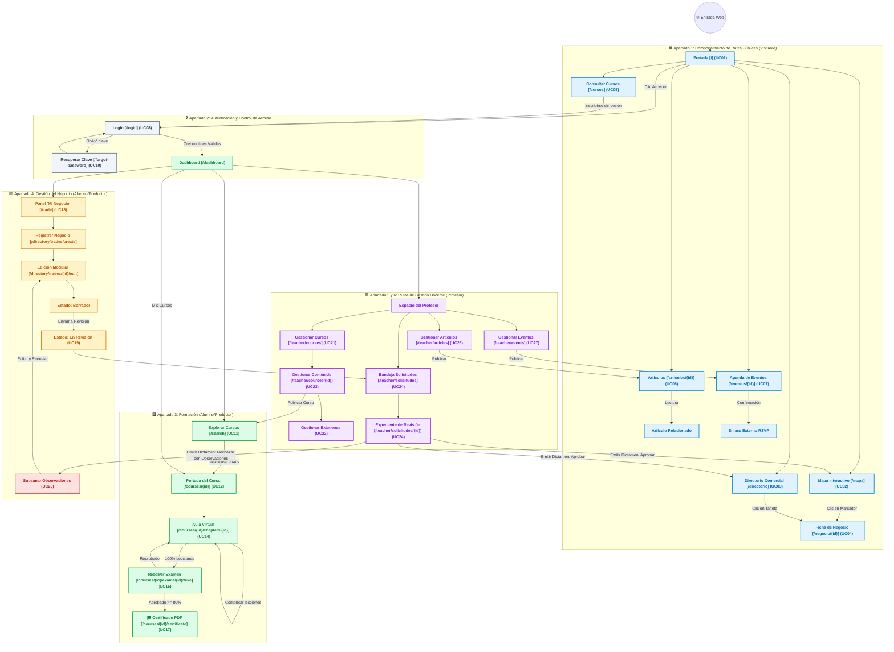

# **Diagrama 5: Comportamiento de Rutas por Apartado y Flujo de Navegación**

Este documento detalla el **comportamiento de rutas, transiciones de pantalla, intercepción de seguridad y navegación interactiva de cada apartado** de la plataforma web, asociando cada acción con su pantalla, su estado resultante y los actores del sistema (**Visitante**, **Alumno/Productor**, **Profesor**).

---

## **1. Glosario de Rutas y Términos por Apartado**

| Rol / Grupo | Ruta / Pantalla | Acción del Usuario | Comportamiento / Resultado |
| :--- | :--- | :--- | :--- |
| **Visitante (Área Pública)** | `/` (Inicio) | Clic en navegación o botones | Dirige a Mapa, Directorio, Artículos, Eventos o Cursos (UC01). |
| **Visitante (Área Pública)** | `/mapa` (Mapa) | Clic en Marcador geográfico | Despliega popup y abre ficha rápida lateral con botón a `/negocio/{id}` (UC02). |
| **Visitante (Área Pública)** | `/directorio` | Filtrar por Giro / Región | Actualiza cuadrícula y navega a `/negocio/{id}` (UC03). |
| **Visitante (Área Pública)** | `/negocio/{id}` | Consultar perfil comercial | Muestra galería, contacto, sellos y mapa con localización (UC04). |
| **Visitante (Área Pública)** | `/articulos/{id}` | Lectura de artículo | Carga contenido y permite saltar a artículos relacionados (UC06). |
| **Visitante (Área Pública)** | `/eventos/{id}` | Consultar evento | Muestra cartelera, ponentes y enlace externo de registro (RSVP) (UC07). |
| **Control de Acceso** | `/login` | Ingreso de credenciales | Si es válido redirige a `/dashboard`; si olvida contraseña va a `/forgot-password` (UC08, UC10). |
| **Control de Acceso** | *Ruta Protegida* | Intento de acceso sin sesión | Intercepción automática y redirección forzada a `/login`. |
| **Alumno/Productor (Formación)** | `/dashboard` | Clic en curso activo | Accede a la portada del curso (`/courses/{id}`) o continúa lección (UC13, UC14). |
| **Alumno/Productor (Formación)** | `/search` | Explorar catálogo de cursos | Inscribirse gratuitamente e iniciar lecciones (UC11, UC12). |
| **Alumno/Productor (Formación)** | `/courses/{id}/chapters/{id}` | Estudiar lección | Consume video/texto/PDF y al marcar completado actualiza el avance (%) (UC14). |
| **Alumno/Productor (Formación)** | `/courses/{id}/exams/{id}/take` | Resolver examen | Envía respuestas; si aprueba (>=80%) y concluye temario, habilita `/certificate` (UC15, UC16, UC17). |
| **Alumno/Productor (Negocio)** | `/trade` | Clic 'Nuevo Negocio' | Registra negocio y pasa a edición modular en estado `Borrador` (UC18). |
| **Alumno/Productor (Negocio)** | `/directory/trades/{id}/edit` | Clic 'Enviar a Revisión' | Cambia a `En Revisión` y bloquea edición hasta dictamen (UC19). |
| **Alumno/Productor (Negocio)** | `/trade` (Rechazado) | Clic 'Subsanar' | Despliega alerta con observaciones del Profesor, edita datos y reenvía (UC20). |
| **Profesor (Gestión Docente)** | `/teacher/courses` | Crear / Editar Curso | Constructor con temario interactivo, capítulos y exámenes (UC21, UC22, UC23). |
| **Profesor (Gestión Docente)** | `/teacher/solicitudes/{id}` | Revisar solicitud | **Aprobar** (publica en mapa/directorio) o **Rechazar** (con observaciones) (UC24, UC25). |
| **Profesor (Gestión Docente)** | `/teacher/articles` / `/events` | Redactar y publicar | Publica artículos y eventos con ponentes en el portal público (UC26, UC27). |

---

## **2. Convención de Colores por Apartado**

* 🟦 **Apartado 1: Rutas Públicas (Azul `#0284C7` / `#E0F2FE`)** - Visitante.
* ⬜ **Apartado 2: Rutas de Autenticación y Control de Acceso (Gris `#475569` / `#F1F5F9`)**.
* 🟩 **Apartado 3: Rutas de Formación (Verde `#16A34A` / `#DCFCE7`)** - Alumno/Productor.
* 🟨 **Apartado 4: Rutas de Gestión del Negocio (Ámbar `#D97706` / `#FEF3C7`)** - Alumno/Productor.
* 🟪 **Apartado 5: Rutas de Gestión Docente (Púrpura `#9333EA` / `#F3E8FF`)** - Profesor.
* 🟥 **Apartado 6: Rutas de Auditoría, Dictamen y Subsanación (Rojo `#DC2626` / `#FEE2E2`)**.

---

## **3. Versión en PlantUML (Compatible con [plantuml.com](https://www.plantuml.com/plantuml/uml/))**

> **Instrucciones:** Copia el siguiente código y pégalo en [https://www.plantuml.com/plantuml/uml/](https://www.plantuml.com/plantuml/uml/) para visualizar el mapa de rutas completo.

```plantuml
@startuml
!theme plain
skinparam state {
  RoundCorner 10
  BorderColor #334155
  BackgroundColor White
}
skinparam ArrowColor #1E293B

' --- COLORES POR APARTADO ---
skinparam state<<Publico>> {
  BackgroundColor #E0F2FE
  BorderColor #0284C7
  FontColor #0369A1
}
skinparam state<<Auth>> {
  BackgroundColor #F1F5F9
  BorderColor #64748B
  FontColor #334155
}
skinparam state<<LMS>> {
  BackgroundColor #DCFCE7
  BorderColor #16A34A
  FontColor #15803D
}
skinparam state<<Trade>> {
  BackgroundColor #FEF3C7
  BorderColor #D97706
  FontColor #B45309
}
skinparam state<<Admin>> {
  BackgroundColor #F3E8FF
  BorderColor #9333EA
  FontColor #7E22CE
}
skinparam state<<Alert>> {
  BackgroundColor #FEE2E2
  BorderColor #DC2626
  FontColor #B91C1C
}

[*] --> R_Inicio : Ingreso a la URL base [/]

' ============================================================
' APARTADO 1: RUTAS PÚBLICAS (VISITANTE)
' ============================================================
state "Apartado 1: Área Pública" as SecPub <<Publico>> {
    state "Portada [/]" as R_Inicio <<Publico>>
    state "Mapa [/mapa]" as R_Mapa <<Publico>>
    state "Directorio [/directorio]" as R_Directorio <<Publico>>
    state "Ficha Negocio [/negocio/{id}]" as R_Negocio <<Publico>>
    state "Artículos [/articulos/{id}]" as R_Articulos <<Publico>>
    state "Eventos [/eventos/{id}]" as R_Eventos <<Publico>>
    state "Portal Cursos [/cursos]" as R_CursosPub <<Publico>>

    R_Inicio --> R_Mapa : Ver Mapa (UC02)
    R_Inicio --> R_Directorio : Ver Directorio (UC03)
    R_Inicio --> R_Articulos : Leer Artículos (UC06)
    R_Inicio --> R_Eventos : Ver Agenda (UC07)
    R_Inicio --> R_CursosPub : Consultar Cursos (UC05)

    R_Mapa --> R_Negocio : Clic en Pin -> 'Ver Ficha' (UC04)
    R_Directorio --> R_Negocio : Clic en Tarjeta (UC04)
    R_Articulos --> R_Articulos : Clic en Artículo Relacionado
    R_Eventos --> R_Eventos : Clic en Enlace RSVP
}

' ============================================================
' APARTADO 2: AUTENTICACIÓN Y SEGURIDAD
' ============================================================
state "Apartado 2: Control de Acceso" as SecAuth <<Auth>> {
    state "Login [/login]" as R_Login <<Auth>>
    state "Recuperar Contraseña [/forgot-password]" as R_Forgot <<Auth>>
    state "Perfil [/profile]" as R_Profile <<Auth>>

    R_Inicio --> R_Login : Clic 'Acceder' (UC08)
    R_CursosPub --> R_Login : Requiere sesión
    R_Login --> R_Forgot : ¿Olvidó clave? (UC10)
    R_Forgot --> R_Login : Correo enviado
}

R_Login --> R_Dashboard : Credenciales Válidas

' ============================================================
' APARTADO 3: FORMACIÓN (ALUMNO/PRODUCTOR)
' ============================================================
state "Apartado 3: Formación" as SecLMS <<LMS>> {
    state "Dashboard [/dashboard]" as R_Dashboard <<LMS>>
    state "Explorador Cursos [/search]" as R_Search <<LMS>>
    state "Portada Curso [/courses/{id}]" as R_CourseCover <<LMS>>
    state "Aula Virtual [/courses/{id}/chapters/{id}]" as R_Classroom <<LMS>>
    state "Examen [/courses/{id}/exams/{id}/take]" as R_ExamTake <<LMS>>
    state "Certificado PDF [/courses/{id}/certificate]" as R_Cert <<LMS>>

    R_Dashboard --> R_Search : Explorar Cursos (UC11)
    R_Search --> R_CourseCover : Inscribirse Gratis (UC12)
    R_Dashboard --> R_CourseCover : Consultar Mis Cursos (UC13)
    R_CourseCover --> R_Classroom : Estudiar Lección (UC14)

    R_Classroom --> R_Classroom : Marcar completado -> Siguiente lección
    R_Classroom --> R_ExamTake : Resolver Examen (UC15)
    R_ExamTake --> R_Classroom : Reprobado (Reintentar)
    R_ExamTake --> R_Cert : Aprobado (>=80%) -> Certificado (UC17)
}

' ============================================================
' APARTADO 4: GESTIÓN DEL NEGOCIO (ALUMNO/PRODUCTOR)
' ============================================================
state "Apartado 4: Gestión del Negocio" as SecTrade <<Trade>> {
    state "Padrón Personal [/trade]" as R_TradeList <<Trade>>
    state "Crear Negocio [/directory/trades/create]" as R_TradeCreate <<Trade>>
    state "Edición Modular [/directory/trades/{id}/edit]" as R_TradeEdit <<Trade>>
    state "Estado: Borrador" as ST_Draft <<Trade>>
    state "Estado: En Revisión" as ST_Pending <<Trade>>
    state "Alerta de Observaciones" as ST_Rejected <<Alert>>

    R_Dashboard --> R_TradeList : Clic 'Mi Negocio'
    R_TradeList --> R_TradeCreate : Nuevo Registro (UC18)
    R_TradeCreate --> R_TradeEdit : Nombre básico asignado
    R_TradeEdit --> ST_Draft : Guardar Cambios
    ST_Draft --> ST_Pending : Enviar a Revisión (UC19)
    ST_Rejected --> R_TradeEdit : Subsanar Observaciones (UC20)
}

' ============================================================
' APARTADO 5 Y 6: GESTIÓN DOCENTE (PROFESOR)
' ============================================================
state "Apartado 5 y 6: Gestión Docente" as SecAdmin <<Admin>> {
    state "Modo Profesor (Topbar Verde)" as R_TeacherMode <<Admin>>
    state "Gestión Cursos [/teacher/courses]" as R_TeacherCourses <<Admin>>
    state "Editor de Temario [/teacher/courses/{id}]" as R_TeacherCourseEdit <<Admin>>
    state "Editor Exámenes [/teacher/courses/{id}/exams/{id}]" as R_TeacherExams <<Admin>>
    state "Bandeja Solicitudes [/teacher/solicitudes]" as R_Requests <<Admin>>
    state "Expediente de Auditoría [/teacher/solicitudes/{id}]" as R_RequestShow <<Admin>>
    state "Gestión Artículos [/teacher/articles]" as R_TeacherArticles <<Admin>>
    state "Gestión Eventos [/teacher/events]" as R_TeacherEvents <<Admin>>

    R_Dashboard --> R_TeacherMode : Espacio Docente
    R_TeacherMode --> R_TeacherCourses : Gestionar Cursos (UC21)
    R_TeacherCourses --> R_TeacherCourseEdit : Gestionar Contenido (UC23)
    R_TeacherCourseEdit --> R_TeacherExams : Gestionar Exámenes (UC22)
    
    R_TeacherMode --> R_Requests : Revisar Solicitudes (UC24)
    R_Requests --> R_RequestShow : Seleccionar Expediente (UC24)
    
    R_TeacherMode --> R_TeacherArticles : Gestionar Artículos (UC26)
    R_TeacherMode --> R_TeacherEvents : Gestionar Eventos (UC27)
}

' --- TRANSICIONES Y CIERRE DE CICLOS ---
ST_Pending --> R_Requests : Ingresa a Bandeja de Revisión
R_RequestShow --> R_Directorio : [UC25 Aprobar] -> Publicado en Directorio y Mapa
R_RequestShow --> ST_Rejected : [UC25 Rechazar] -> Notifica Observaciones Obligatorias

R_TeacherCourseEdit --> R_Search : [Publicar Curso] -> Visible en Catálogo
R_TeacherArticles --> R_Articulos : [Publicar] -> Visible en Portal
R_TeacherEvents --> R_Eventos : [Publicar] -> Visible en Portal

@enduml
```

---

## **4. Versión en Mermaid (Diagrama de Comportamiento de Rutas)**

---

## **5. Resumen del Comportamiento por Apartado**

1. **Apartado 1 (Área Pública - Visitante):** Permite el descubrimiento geográfico y comercial abierto. Todas las tarjetas y marcadores conducen a la ficha detallada de negocio (`/negocio/{id}`).
2. **Apartado 2 (Control de Acceso):** Resguarda las rutas privadas. Cualquier intento de acceso no autenticado redirige a `/login`.
3. **Apartado 3 (Formación - Alumno/Productor):** Flujo de aprendizaje secuencial: Explorar catálogo -> Inscripción gratuita -> Lecciones con verificación -> Examen calificado con retroalimentación -> Certificado PDF emitido.
4. **Apartado 4 (Gestión del Negocio - Alumno/Productor):** Registro modular y flujo de trámite: Borrador -> Envío a revisión -> Bloqueo preventivo de edición -> Dictamen -> Subsanación de observaciones en caso de rechazo y reenvío.
5. **Apartado 5 y 6 (Gestión Docente - Profesor):** Espacio especializado para estructurar cursos, exámenes, contenidos formativos, redactar publicaciones y auditar solicitudes comerciales emitiendo dictámenes fundamentados.
