# **Diagrama 6: Mapa de Rutas y Navegación de la Plataforma**

Este documento constituye la especificación oficial y validada del **Mapa de Rutas y Navegación** de la **Plataforma Web de la Reserva de la Biosfera Tehuacán-Cuicatlán**.

El objetivo exclusivo de este modelo es reflejar con precisión técnica cómo un usuario se desplaza entre las distintas pantallas, páginas y módulos de la aplicación, basándose en la auditoría exhaustiva del código fuente (`routes/web.php`, `config/fortify.php`, controladores y componentes React con Inertia.js).

---

## **1. Principios de Navegación y Hallazgos de la Auditoría**

1. **Diferenciación de Destinos tras Login y Registro:**
   - La plataforma utiliza **Laravel Fortify**. Su configuración (`config/fortify.php`) define `'home' => '/dashboard'`.
   - Tanto el login exitoso (`POST /login`) como el registro (`POST /register`) redirigen al usuario estándar a `/dashboard` (**Mis Cursos / Panel de Formación**).
   - **No existe redirección automática condicional por rol hacia el área docente.** El **Profesor** aterriza en `/dashboard` y accede a sus módulos administrativos pulsando explícitamente el botón **"Modo Profesor"** en la barra superior de la interfaz (`MainLayout.jsx`).
2. **Independencia Modular del Área Privada (Alumno/Productor):**
   - El panel privado no subordina los módulos entre sí. Desde la barra lateral de navegación (`MainLayout.jsx`), el Alumno/Productor puede conmutar directamente entre:
     - **Mis Cursos** (`/dashboard`)
     - **Explorar Cursos** (`/search`)
     - **Mi Negocio** (`/trade`)
     - **Enlaces de Interés** (`/links`)
     - **Mi Perfil** (`/profile`)
3. **Paso Obligatorio por Portada de Curso:**
   - En **Mis Cursos** y en **Explorar Cursos**, las tarjetas de curso (`CourseCard.jsx`) enlazan a la **Portada de Curso** (`/courses/{course}`).
   - La entrada al **Aula Virtual** (`/courses/{course}/chapters/{chapter}`) se produce desde la portada mediante la acción "Comenzar" o seleccionando una lección del temario.
4. **Ciclo de Examen dentro del Aula:**
   - La **Sala de Examen** (`/courses/{course}/exams/{exam}`) y la pantalla de **Resolución de Examen** (`/courses/{course}/exams/{exam}/take`) están integradas en la navegación del curso.
   - Tras calificar el intento, el sistema redirige a la vista de resultados (`courses.exams.show`), la cual está envuelta en `CourseLayout.jsx`, permitiendo al estudiante volver a cualquier lección en el menú lateral o reintentar la prueba.
5. **Autonomía Modular en el Área Profesor:**
   - Una vez en el Área Profesor (`/teacher/*`), el menú lateral (`teacherRoutes`) habilita navegación directa e independiente entre:
     - **Gestión de Cursos** (`/teacher/courses`)
     - **Bandeja de Solicitudes** (`/teacher/solicitudes`)
     - **Gestión de Artículos** (`/teacher/articles`)
     - **Gestión de Eventos** (`/teacher/events`)
     - **Mi Perfil** (`/profile`)

---

## **2. Catálogo y Matriz de Rutas Validadas**

| Identificador | Pantalla / Página | Ruta URL | Controlador / Vista React | Rol / Acceso |
| :--- | :--- | :--- | :--- | :--- |
| `P_Inicio` | Inicio / Portada | `/` | `LandingPage.jsx` | Público |
| `P_Mapa` | Mapa Interactivo | `/mapa` | `Mapa.jsx` | Público |
| `P_Directorio` | Directorio Comercial | `/directorio` | `Directorio.jsx` | Público |
| `P_DetalleNeg` | Detalle del Negocio | `/directorio/{slug}` | `TradeDetail.jsx` | Público |
| `P_Articulos` | Artículos de Divulgación | `/articulos` | `Articulos/Index.jsx` | Público |
| `P_ArticuloDet` | Detalle del Artículo | `/articulos/{id}` | `Articulos/Show.jsx` | Público |
| `P_Eventos` | Agenda de Eventos | `/eventos` | `Eventos/Index.jsx` | Público |
| `P_EventoDet` | Detalle del Evento | `/eventos/{id}` | `Eventos/Show.jsx` | Público |
| `P_CursosPub` | Oferta Formativa Pública | `/cursos` | `Cursos.jsx` | Público |
| `P_Login` | Inicio de Sesión | `/login` | `Auth/Login.jsx` (Fortify) | Público |
| `P_Registro` | Registro de Cuenta | `/register` | `Auth/Register.jsx` (Fortify) | Público |
| `P_PassForgot` | Recuperar Contraseña | `/forgot-password` | `Auth/ForgotPassword.jsx` | Público |
| `P_MisCursos` | Mis Cursos (Panel Principal) | `/dashboard` | `Dashboard/Index.jsx` | Alumno/Productor |
| `P_Explorar` | Explorar Cursos | `/search` | `Dashboard/Search/Index.jsx` | Alumno/Productor |
| `P_PortadaCurso`| Portada del Curso | `/courses/{course}` | `Courses/Show/Cover.jsx` | Alumno/Productor |
| `P_Aula` | Aula Virtual (Capítulo) | `/courses/{course}/chapters/{chapter}` | `Courses/Show/Index.jsx` | Alumno/Productor |
| `P_Examen` | Sala / Resultados de Examen | `/courses/{course}/exams/{exam}` | `Courses/Exams/Show.jsx` | Alumno/Productor |
| `P_RendirExamen`| Resolver Examen | `/courses/{course}/exams/{exam}/take` | `Courses/Exams/Take.jsx` | Alumno/Productor |
| `P_Certificado` | Descarga de Certificado | `/courses/{course}/certificate` | `CertificateController@download` | Alumno/Productor |
| `P_MiNegocio` | Mi Negocio (Listado) | `/trade` | `Dashboard/Trades/Index.jsx` | Alumno/Productor |
| `P_CrearNeg` | Registrar Negocio | `/directory/trades/create` | `Dashboard/Trades/Create.jsx` | Alumno/Productor |
| `P_EditarNeg` | Editar Negocio | `/directory/trades/{trade}/edit` | `Dashboard/Trades/Edit/Index.jsx` | Alumno/Productor |
| `P_Links` | Enlaces de Interés | `/links` | `Dashboard/Links/Index.jsx` | Alumno/Productor |
| `P_Perfil` | Perfil de Usuario | `/profile` | `Profile/Show.jsx` | Alumno y Profesor |
| `P_TCursos` | Gestión de Cursos | `/teacher/courses` | `Dashboard/Teacher/Courses/Index.jsx` | Profesor |
| `P_TCrearCurso` | Crear Curso | `/teacher/create` | `Dashboard/Teacher/Courses/Create.jsx` | Profesor |
| `P_TEditCurso` | Editar Curso | `/teacher/courses/{course}` | `Dashboard/Teacher/Courses/Edit/Index.jsx` | Profesor |
| `P_TEditCap` | Editar Capítulo | `/teacher/courses/{course}/chapters/{chapter}` | `Dashboard/Teacher/Courses/Chapters/Edit.jsx` | Profesor |
| `P_TEditExam` | Editar Examen | `/teacher/courses/{course}/exams/{exam}` | `Dashboard/Teacher/Courses/Exams/Edit.jsx` | Profesor |
| `P_TSolicitudes`| Bandeja de Solicitudes | `/teacher/solicitudes` | `Dashboard/Teacher/Solicitudes/Index.jsx` | Profesor |
| `P_TRevSol` | Revisar Solicitud | `/teacher/solicitudes/{id}` | `Dashboard/Teacher/Solicitudes/Show.jsx` | Profesor |
| `P_TArticulos` | Gestión de Artículos | `/teacher/articles` | `Dashboard/Teacher/Articles/Index.jsx` | Profesor |
| `P_TEditArt` | Crear / Editar Artículo | `/teacher/articles/create` o `/{id}/edit` | `Dashboard/Teacher/Articles/Edit.jsx` | Profesor |
| `P_TEventos` | Gestión de Eventos | `/teacher/events` | `Dashboard/Teacher/Events/Index.jsx` | Profesor |
| `P_TEditEve` | Crear / Editar Evento | `/teacher/events/create` o `/{id}/edit` | `Dashboard/Teacher/Events/Edit.jsx` | Profesor |

---

## **3. Diagrama en PlantUML (Navegación y Rutas)**

```plantuml
@startuml
!theme plain
skinparam roundcorner 10
skinparam shadowing false
skinparam defaultFontName "Segoe UI", sans-serif
skinparam defaultFontSize 12
skinparam ArrowColor #334155
skinparam ArrowThickness 1.2

skinparam state {
  BackgroundColor White
  BorderColor #475569
  FontColor #1E293B
}

' Paletas de color por área
skinparam state<<Publico>> {
  BackgroundColor #E0F2FE
  BorderColor #0284C7
  FontColor #0369A1
}
skinparam state<<Auth>> {
  BackgroundColor #F1F5F9
  BorderColor #64748B
  FontColor #334155
}
skinparam state<<Alumno>> {
  BackgroundColor #DCFCE7
  BorderColor #16A34A
  FontColor #15803D
}
skinparam state<<Profesor>> {
  BackgroundColor #F3E8FF
  BorderColor #9333EA
  FontColor #7E22CE
}

[*] --> P_Inicio : Ingreso al portal

' ==========================================
' ÁREA PÚBLICA
' ==========================================
state "Área Pública" as AreaPublica <<Publico>> {
  state "Inicio / Portada [/]" as P_Inicio <<Publico>>
  state "Mapa Interactivo [/mapa]" as P_Mapa <<Publico>>
  state "Directorio Comercial [/directorio]" as P_Directorio <<Publico>>
  state "Detalle de Negocio [/directorio/{slug}]" as P_DetalleNeg <<Publico>>
  state "Artículos [/articulos]" as P_Articulos <<Publico>>
  state "Detalle de Artículo [/articulos/{id}]" as P_ArticuloDet <<Publico>>
  state "Eventos [/eventos]" as P_Eventos <<Publico>>
  state "Detalle de Evento [/eventos/{id}]" as P_EventoDet <<Publico>>
  state "Oferta de Cursos [/cursos]" as P_CursosPub <<Publico>>

  P_Inicio --> P_Mapa : "Mapa"
  P_Inicio --> P_Directorio : "Directorio"
  P_Inicio --> P_Articulos : "Artículos"
  P_Inicio --> P_Eventos : "Eventos"
  P_Inicio --> P_CursosPub : "Cursos"

  P_Mapa --> P_DetalleNeg : "Ver ficha"
  P_Directorio --> P_DetalleNeg : "Seleccionar negocio"
  P_Articulos --> P_ArticuloDet : "Leer artículo"
  P_Eventos --> P_EventoDet : "Ver evento"
}

' ==========================================
' AUTENTICACIÓN
' ==========================================
state "Autenticación" as AreaAuth <<Auth>> {
  state "Iniciar Sesión [/login]" as P_Login <<Auth>>
  state "Registrarse [/register]" as P_Registro <<Auth>>
  state "Recuperar Contraseña [/forgot-password]" as P_PassForgot <<Auth>>

  P_Login --> P_PassForgot : "¿Olvidaste tu contraseña?"
  P_Login --> P_Registro : "Crear cuenta"
  P_Registro --> P_Login : "Ya tengo cuenta"
}

P_Inicio --> P_Login : "Acceder"
P_Inicio --> P_Registro : "Registrarse"

' ==========================================
' ÁREA ALUMNO / PRODUCTOR
' ==========================================
state "Área Alumno / Productor" as AreaAlumno <<Alumno>> {
  state "Mis Cursos [/dashboard]" as P_MisCursos <<Alumno>>
  state "Explorar Cursos [/search]" as P_Explorar <<Alumno>>
  state "Portada de Curso [/courses/{id}]" as P_PortadaCurso <<Alumno>>
  state "Aula Virtual [/courses/{id}/chapters/{id}]" as P_Aula <<Alumno>>
  state "Sala / Resultados de Examen [/courses/{id}/exams/{id}]" as P_Examen <<Alumno>>
  state "Resolver Examen [/courses/{id}/exams/{id}/take]" as P_RendirExamen <<Alumno>>
  state "Descargar Certificado [/courses/{id}/certificate]" as P_Certificado <<Alumno>>

  state "Mi Negocio [/trade]" as P_MiNegocio <<Alumno>>
  state "Registrar Negocio [/directory/trades/create]" as P_CrearNeg <<Alumno>>
  state "Edición del Negocio [/directory/trades/{id}/edit]" as P_EditarNeg <<Alumno>>

  state "Enlaces de Interés [/links]" as P_Links <<Alumno>>
  state "Mi Perfil [/profile]" as P_Perfil <<Alumno>>

  ' Navegación modular lateral
  P_MisCursos --> P_Explorar : "Explorar más cursos"
  P_MisCursos --> P_MiNegocio : "Mi Negocio"
  P_MisCursos --> P_Links : "Enlaces de interés"
  P_MisCursos --> P_Perfil : "Mi Perfil"

  P_Explorar --> P_PortadaCurso : "Seleccionar curso"
  P_MisCursos --> P_PortadaCurso : "Continuar curso"
  P_PortadaCurso --> P_Aula : "Comenzar / Ver capítulo"

  ' Flujo interno de curso
  P_Aula --> P_Examen : "Ir a examen"
  P_Aula --> P_Certificado : "Descargar certificado (100%)"
  P_Examen --> P_RendirExamen : "Comenzar / Reintentar examen"
  P_RendirExamen --> P_Examen : "Enviar examen (ver resultados)"
  P_Examen --> P_Aula : "Volver a lecciones"

  ' Flujo de Negocio
  P_MiNegocio --> P_CrearNeg : "Nuevo negocio"
  P_MiNegocio --> P_EditarNeg : "Editar negocio"
  P_EditarNeg --> P_MiNegocio : "Volver al listado"
}

' Redirecciones confirmadas tras Login y Registro
P_Login --> P_MisCursos : "Acceder (redirección a /dashboard)"
P_Registro --> P_MisCursos : "Registro exitoso"

' ==========================================
' ÁREA PROFESOR
' ==========================================
state "Área Profesor" as AreaProfesor <<Profesor>> {
  state "Gestión de Cursos [/teacher/courses]" as P_TCursos <<Profesor>>
  state "Crear Curso [/teacher/create]" as P_TCrearCurso <<Profesor>>
  state "Editar Curso [/teacher/courses/{id}]" as P_TEditCurso <<Profesor>>
  state "Editar Capítulo [/teacher/courses/{id}/chapters/{id}]" as P_TEditCap <<Profesor>>
  state "Editar Examen [/teacher/courses/{id}/exams/{id}]" as P_TEditExam <<Profesor>>

  state "Bandeja de Solicitudes [/teacher/solicitudes]" as P_TSolicitudes <<Profesor>>
  state "Revisar Solicitud [/teacher/solicitudes/{id}]" as P_TRevSol <<Profesor>>

  state "Gestión de Artículos [/teacher/articles]" as P_TArticulos <<Profesor>>
  state "Crear / Editar Artículo [/teacher/articles/...]" as P_TEditArt <<Profesor>>

  state "Gestión de Eventos [/teacher/events]" as P_TEventos <<Profesor>>
  state "Crear / Editar Evento [/teacher/events/...]" as P_TEditEve <<Profesor>>

  state "Perfil de Profesor [/profile]" as P_TPerfil <<Profesor>>

  ' Subflujo de Cursos
  P_TCursos --> P_TCrearCurso : "Nuevo Curso"
  P_TCrearCurso --> P_TEditCurso : "Guardar y continuar"
  P_TCursos --> P_TEditCurso : "Seleccionar curso"
  P_TEditCurso --> P_TEditCap : "Editar capítulo"
  P_TEditCurso --> P_TEditExam : "Editar examen"
  P_TEditCap --> P_TEditCurso : "Volver al curso"
  P_TEditExam --> P_TEditCurso : "Volver al curso"

  ' Subflujo de Solicitudes
  P_TSolicitudes --> P_TRevSol : "Auditar solicitud"
  P_TRevSol --> P_TSolicitudes : "Volver / Tras dictamen"

  ' Subflujo de Artículos y Eventos
  P_TArticulos --> P_TEditArt : "Nuevo / Editar"
  P_TEditArt --> P_TArticulos : "Guardar y volver"
  P_TEventos --> P_TEditEve : "Nuevo / Editar"
  P_TEditEve --> P_TEventos : "Guardar y volver"

  ' Menú lateral del profesor
  P_TCursos --> P_TSolicitudes : "Solicitudes"
  P_TCursos --> P_TArticulos : "Artículos"
  P_TCursos --> P_TEventos : "Eventos"
  P_TCursos --> P_TPerfil : "Mi Perfil"
}

' Conmutador de modo en la barra superior
P_MisCursos --> P_TCursos : "Botón 'Modo Profesor' (Topbar)"
P_TCursos --> P_MisCursos : "Botón 'Salir Modo Profesor'"

@enduml
```

---

## **4. Diagrama en Mermaid (Visualización Interactiva)**

```mermaid
flowchart TD
    %% ESTILOS VISUALES
    classDef pub fill:#e0f2fe,stroke:#0284c7,stroke-width:2px,color:#0369a1;
    classDef auth fill:#f1f5f9,stroke:#64748b,stroke-width:2px,color:#334155;
    classDef alum fill:#dcfce7,stroke:#16a34a,stroke-width:2px,color:#15803d;
    classDef prof fill:#f3e8ff,stroke:#9333ea,stroke-width:2px,color:#7e22ce;

    %% INGRESO
    START((🌐 Web)) --> P_INICIO["Inicio / Portada (/)"]:::pub

    %% ================= ÁREA PÚBLICA =================
    subgraph SEC_PUB["🟦 Área Pública (Visitante)"]
        P_INICIO -->|Mapa| P_MAPA["Mapa (/mapa)"]:::pub
        P_INICIO -->|Directorio| P_DIR["Directorio Comercial (/directorio)"]:::pub
        P_INICIO -->|Artículos| P_ART["Artículos (/articulos)"]:::pub
        P_INICIO -->|Eventos| P_EVE["Eventos (/eventos)"]:::pub
        P_INICIO -->|Cursos| P_CUR_PUB["Oferta de Cursos (/cursos)"]:::pub

        P_MAPA -->|Ver ficha| P_FICHA["Detalle de Negocio (/directorio/:slug)"]:::pub
        P_DIR -->|Seleccionar negocio| P_FICHA
        P_ART -->|Leer| P_ART_DET["Detalle Artículo (/articulos/:id)"]:::pub
        P_EVE -->|Ver evento| P_EVE_DET["Detalle Evento (/eventos/:id)"]:::pub
    end

    %% ================= AUTENTICACIÓN =================
    subgraph SEC_AUTH["⬜ Autenticación"]
        P_LOGIN["Iniciar Sesión (/login)"]:::auth
        P_REG["Registrarse (/register)"]:::auth
        P_FORGOT["Recuperar Contraseña (/forgot-password)"]:::auth

        P_LOGIN -->|¿Olvidaste contraseña?| P_FORGOT
        P_LOGIN <-->|Alternar| P_REG
    end

    P_INICIO -->|Acceder| P_LOGIN
    P_INICIO -->|Registrarse| P_REG

    %% REDIRECCIONES POST-LOGIN
    P_LOGIN -->|Credenciales válidas| P_DASH["Mis Cursos (/dashboard)"]:::alum
    P_REG -->|Registro exitoso| P_DASH

    %% ================= ÁREA ALUMNO / PRODUCTOR =================
    subgraph SEC_ALUM["🟩 Área Alumno / Productor"]
        P_DASH
        P_EXPLORAR["Explorar Cursos (/search)"]:::alum
        P_PORTADA["Portada del Curso (/courses/:id)"]:::alum
        P_AULA["Aula Virtual (/courses/:id/chapters/:id)"]:::alum
        P_EXAM_SHOW["Sala / Resultados Examen (/courses/:id/exams/:id)"]:::alum
        P_EXAM_TAKE["Resolver Examen (/courses/:id/exams/:id/take)"]:::alum
        P_CERT["Descargar Certificado (/courses/:id/certificate)"]:::alum

        P_TRADE["Mi Negocio (/trade)"]:::alum
        P_TRADE_CREATE["Registrar Negocio (/directory/trades/create)"]:::alum
        P_TRADE_EDIT["Editar Negocio (/directory/trades/:id/edit)"]:::alum

        P_LINKS["Enlaces de Interés (/links)"]:::alum
        P_PERFIL["Mi Perfil (/profile)"]:::alum

        %% Rutas internas Alumno
        P_DASH -->|Explorar más cursos| P_EXPLORAR
        P_DASH -->|Mi Negocio| P_TRADE
        P_DASH -->|Enlaces| P_LINKS
        P_DASH -->|Perfil| P_PERFIL

        P_EXPLORAR -->|Seleccionar curso| P_PORTADA
        P_DASH -->|Continuar curso| P_PORTADA
        P_PORTADA -->|Comenzar| P_AULA

        P_AULA -->|Ir a examen| P_EXAM_SHOW
        P_AULA -->|100% completado| P_CERT
        P_EXAM_SHOW -->|Comenzar / Reintentar| P_EXAM_TAKE
        P_EXAM_TAKE -->|Enviar respuestas| P_EXAM_SHOW
        P_EXAM_SHOW -->|Volver a lección| P_AULA

        P_TRADE -->|Nuevo negocio| P_TRADE_CREATE
        P_TRADE -->|Editar negocio| P_TRADE_EDIT
        P_TRADE_EDIT -->|Volver| P_TRADE
    end

    %% CONMUTACIÓN AL MODO PROFESOR
    P_DASH -->|Botón 'Modo Profesor'| P_T_CURSOS["Gestión de Cursos (/teacher/courses)"]:::prof

    %% ================= ÁREA PROFESOR =================
    subgraph SEC_PROF["🟪 Área Profesor"]
        P_T_CURSOS
        P_T_CREATE["Crear Curso (/teacher/create)"]:::prof
        P_T_EDIT["Editar Curso (/teacher/courses/:id)"]:::prof
        P_T_CAP["Editar Capítulo (/teacher/courses/:id/chapters/:id)"]:::prof
        P_T_EXAM["Editar Examen (/teacher/courses/:id/exams/:id)"]:::prof

        P_T_SOL["Bandeja Solicitudes (/teacher/solicitudes)"]:::prof
        P_T_REV["Revisar Solicitud (/teacher/solicitudes/:id)"]:::prof

        P_T_ART["Gestión Artículos (/teacher/articles)"]:::prof
        P_T_ART_EDIT["Crear/Editar Artículo (/teacher/articles/...)"]:::prof

        P_T_EVE["Gestión Eventos (/teacher/events)"]:::prof
        P_T_EVE_EDIT["Crear/Editar Evento (/teacher/events/...)"]:::prof

        P_T_PERFIL["Mi Perfil (/profile)"]:::prof

        %% Navegación interna Profesor
        P_T_CURSOS -->|Nuevo Curso| P_T_CREATE
        P_T_CREATE -->|Guardar| P_T_EDIT
        P_T_CURSOS -->|Editar| P_T_EDIT
        P_T_EDIT -->|Capítulo| P_T_CAP
        P_T_EDIT -->|Examen| P_T_EXAM
        P_T_CAP -->|Volver| P_T_EDIT
        P_T_EXAM -->|Volver| P_T_EDIT

        P_T_SOL -->|Auditar| P_T_REV
        P_T_REV -->|Volver| P_T_SOL

        P_T_ART -->|Nuevo / Editar| P_T_ART_EDIT
        P_T_ART_EDIT -->|Volver| P_T_ART

        P_T_EVE -->|Nuevo / Editar| P_T_EVE_EDIT
        P_T_EVE_EDIT -->|Volver| P_T_EVE

        %% Menú lateral profesor
        P_T_CURSOS <-->|Menú lateral| P_T_SOL
        P_T_CURSOS <-->|Menú lateral| P_T_ART
        P_T_CURSOS <-->|Menú lateral| P_T_EVE
        P_T_CURSOS -->|Perfil| P_T_PERFIL
    end

    P_T_CURSOS -->|Salir de Modo Profesor| P_DASH
```

