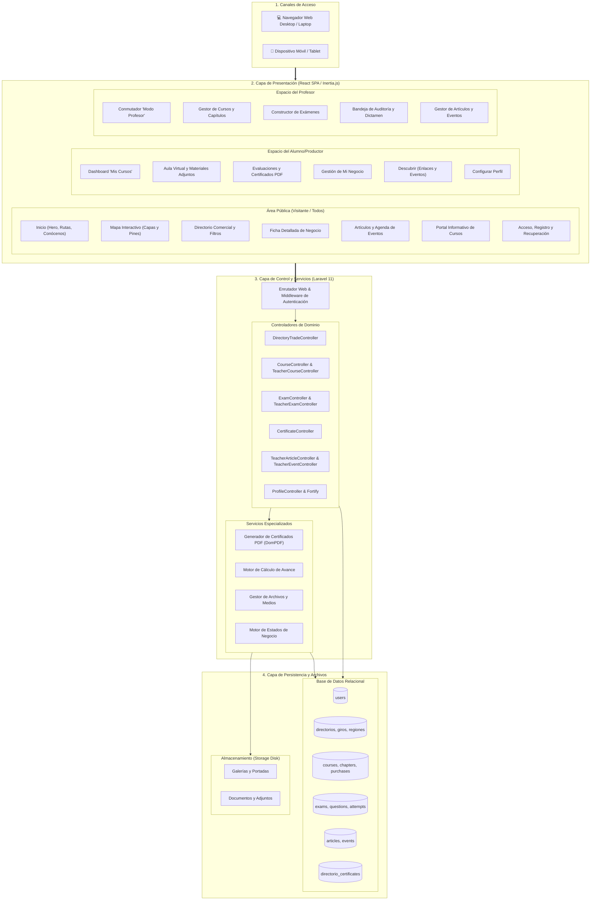
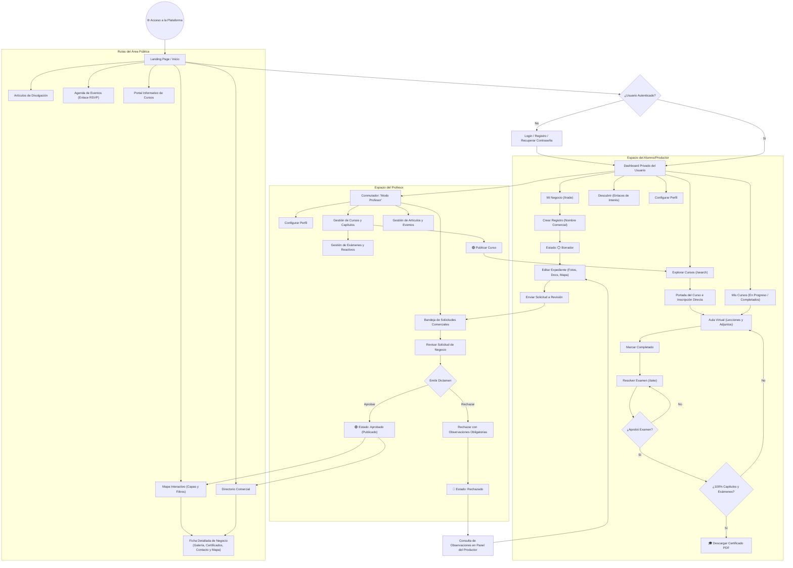

# **Documento de Diagramas: Casos de Uso, Arquitectura y Comportamiento de la Plataforma**

> **Referencia de Alcance:** Basado en la especificación validada de la [*Plataforma Web de la Reserva de la Biosfera Tehuacán-Cuicatlán*](file:///c:/Users/DaveCuc/Projects/turismo-platform/tests/react-inertia-starter-main/documentacion/Diagrama_1_Casos_de_Uso.md) y el [*Documento de Alcance de Evaluación V3*](file:///c:/Users/DaveCuc/Projects/turismo-platform/tests/react-inertia-starter-main/documentacion/Documento%20de%20Alcance%20de%20Evaluaci%C3%B3n_%20Arquitectura%20y%20M%C3%B3dulos%20de%20la%20Plataforma%20V3.md).

Este documento reúne los diagramas fundamentales para el análisis, evaluación y comprensión integral del sistema:
1. **Diagrama de Casos de Uso del Sistema** (En sintaxis **PlantUML** y **Mermaid**, validado con 29 casos de uso, 3 actores y 6 grupos funcionales).
2. **Diagrama de Arquitectura Conceptual y Modular de la Plataforma** (En sintaxis **PlantUML** y **Mermaid**).
3. **Diagrama de Comportamiento de Rutas, Flujos de Navegación y Ciclo de Estados** (En sintaxis **PlantUML** y **Mermaid**).
4. [**Diagrama de Mapa de Rutas y Navegación de la Plataforma**](file:///c:/Users/DaveCuc/Projects/turismo-platform/tests/react-inertia-starter-main/documentacion/Diagrama_6_Mapa_de_Rutas_y_Navegacion.md) (Especificación técnica de rutas URL exactas, navegación de pantallas y redirecciones verificadas contra código).

---

## **1. Diagrama de Casos de Uso del Sistema**

Modela las interacciones directas entre los tres actores oficiales y las funcionalidades dentro de la frontera del sistema.

### **1.1. Actores Oficiales**
* 👤 **Visitante:** Usuario público no autenticado. Navega por el portal libremente para consultar el inicio, mapa interactivo, directorio comercial, fichas de negocio, cursos informativos, artículos y eventos, además de iniciar sesión, registrarse o recuperar contraseña.
* 🌾 **Alumno/Productor:** Usuario autenticado estándar. Accede a las funciones públicas, al módulo de **Formación** (explorar cursos, inscribirse, aula virtual, exámenes y descarga de certificados), a la **Gestión del Negocio** (registrar y editar su comercio local, postular su solicitud y subsanar observaciones), al **Contenido del Usuario** (enlaces de interés) y a la configuración de su **Perfil de Usuario**.
* 👨‍🏫 **Profesor:** Usuario autenticado con atribuciones docentes y de moderación. Accede a las funciones públicas, a la **Gestión Docente** (gestión de cursos, temarios multimedia, banco de exámenes, revisión de solicitudes comerciales, emisión de dictamen aprobatorio o rechazo con observaciones, y administración de artículos y eventos) y a la configuración de su **Perfil de Usuario**.

> **Reglas de Modelado:**
> * **Frontera del Sistema:** *"Plataforma Web de la Reserva de la Biosfera Tehuacán-Cuicatlán"*.
> * **Agrupaciones Funcionales:** Área Pública (UC01–UC10), Formación (UC11–UC17), Gestión del Negocio (UC18–UC20), Contenido del Usuario (UC29), Perfil de Usuario (UC28) y Gestión Docente (UC21–UC27).
> * **Relación `<<include>>` Única:** `UC24 Revisar solicitudes de negocio ..> UC25 Emitir dictamen : <<include>>`.
> * **Sin relaciones `<<extend>>`** y **sin generalización de actores**.

---

### **1.2. Versión en PlantUML (Compatible con [plantuml.com](https://www.plantuml.com/plantuml/uml/))**

```plantuml
@startuml
!theme plain
skinparam packageStyle rectangle
skinparam roundcorner 10
skinparam actorStyle awesome
skinparam shadowing false
left to right direction

' --- ESTILOS SOBRIOS Y ACADÉMICOS ---
skinparam rectangle {
    BackgroundColor #F8FAFC
    BorderColor #94A3B8
    FontColor #334155
}
skinparam usecase {
    BackgroundColor #FFFFFF
    BorderColor #64748B
    FontColor #0F172A
}
skinparam actor {
    BackgroundColor #F1F5F9
    BorderColor #475569
    FontColor #1E293B
}

' --- ACTORES ---
actor "Visitante" as V
actor "Alumno/Productor" as A
actor "Profesor" as P

' --- FRONTERA DEL SISTEMA ---
rectangle "Plataforma Web de la Reserva de la Biosfera Tehuacán-Cuicatlán" {

    rectangle "Área Pública" {
        usecase "UC01 Explorar página de inicio" as UC01
        usecase "UC02 Consultar mapa" as UC02
        usecase "UC03 Consultar directorio comercial" as UC03
        usecase "UC04 Consultar detalle de negocio" as UC04
        usecase "UC05 Consultar cursos" as UC05
        usecase "UC06 Consultar artículos" as UC06
        usecase "UC07 Consultar eventos" as UC07
        usecase "UC08 Iniciar sesión" as UC08
        usecase "UC09 Registrarse" as UC09
        usecase "UC10 Recuperar contraseña" as UC10
    }

    rectangle "Formación" {
        usecase "UC11 Explorar cursos" as UC11
        usecase "UC12 Inscribirse a curso" as UC12
        usecase "UC13 Consultar mis cursos" as UC13
        usecase "UC14 Estudiar en aula virtual" as UC14
        usecase "UC15 Resolver examen" as UC15
        usecase "UC16 Consultar resultados" as UC16
        usecase "UC17 Descargar certificado" as UC17
    }

    rectangle "Gestión del Negocio" {
        usecase "UC18 Gestionar mi negocio" as UC18
        usecase "UC19 Enviar solicitud a revisión" as UC19
        usecase "UC20 Subsanar observaciones" as UC20
    }

    rectangle "Contenido del Usuario" {
        usecase "UC29 Consultar enlaces de interés" as UC29
    }

    rectangle "Perfil de Usuario" {
        usecase "UC28 Configurar perfil" as UC28
    }

    rectangle "Gestión Docente" {
        usecase "UC21 Gestionar cursos" as UC21
        usecase "UC22 Gestionar exámenes" as UC22
        usecase "UC23 Gestionar contenido de cursos" as UC23
        usecase "UC24 Revisar solicitudes de negocio" as UC24
        usecase "UC25 Emitir dictamen" as UC25
        usecase "UC26 Gestionar artículos" as UC26
        usecase "UC27 Gestionar eventos" as UC27
    }
}

' --- RELACIÓN INCLUDE ---
UC24 ..> UC25 : <<include>>

' --- ASOCIACIONES: VISITANTE ---
V --> UC01
V --> UC02
V --> UC03
V --> UC04
V --> UC05
V --> UC06
V --> UC07
V --> UC08
V --> UC09
V --> UC10

' --- ASOCIACIONES: ALUMNO/PRODUCTOR ---
' Área pública
A --> UC01
A --> UC02
A --> UC03
A --> UC04
A --> UC05
A --> UC06
A --> UC07
' Formación
A --> UC11
A --> UC12
A --> UC13
A --> UC14
A --> UC15
A --> UC16
A --> UC17
' Gestión del Negocio
A --> UC18
A --> UC19
A --> UC20
' Contenido del Usuario
A --> UC29
' Perfil de Usuario
A --> UC28

' --- ASOCIACIONES: PROFESOR ---
' Área pública
P --> UC01
P --> UC02
P --> UC03
P --> UC04
P --> UC05
P --> UC06
P --> UC07
' Gestión Docente
P --> UC21
P --> UC22
P --> UC23
P --> UC24
P --> UC25
P --> UC26
P --> UC27
' Perfil de Usuario
P --> UC28
@enduml
```



---

### **1.3. Versión en Mermaid (Casos de Uso)**

```mermaid
flowchart LR
    %% ESTILOS GENERALES
    classDef boundary fill:#F8FAFC,stroke:#94A3B8,stroke-width:2px,color:#1E293B,font-weight:bold;
    classDef pub fill:#FFFFFF,stroke:#64748B,stroke-width:1.5px,color:#0F172A;
    classDef lms fill:#FFFFFF,stroke:#64748B,stroke-width:1.5px,color:#0F172A;
    classDef trade fill:#FFFFFF,stroke:#64748B,stroke-width:1.5px,color:#0F172A;
    classDef content fill:#FFFFFF,stroke:#64748B,stroke-width:1.5px,color:#0F172A;
    classDef profile fill:#FFFFFF,stroke:#64748B,stroke-width:1.5px,color:#0F172A;
    classDef doc fill:#FFFFFF,stroke:#64748B,stroke-width:1.5px,color:#0F172A;
    classDef actor fill:#F1F5F9,stroke:#475569,stroke-width:2px,color:#1E293B,font-weight:bold;

    %% ACTORES
    subgraph ACTORES["👥 Actores"]
        V["👤 Visitante"]:::actor
        A["🌾 Alumno/Productor"]:::actor
        P["👨‍🏫 Profesor"]:::actor
    end

    %% FRONTERA DEL SISTEMA
    subgraph SISTEMA["Plataforma Web de la Reserva de la Biosfera Tehuacán-Cuicatlán"]:::boundary

        subgraph G_PUB["Área Pública"]
            UC01["UC01 Explorar página de inicio"]:::pub
            UC02["UC02 Consultar mapa"]:::pub
            UC03["UC03 Consultar directorio comercial"]:::pub
            UC04["UC04 Consultar detalle de negocio"]:::pub
            UC05["UC05 Consultar cursos"]:::pub
            UC06["UC06 Consultar artículos"]:::pub
            UC07["UC07 Consultar eventos"]:::pub
            UC08["UC08 Iniciar sesión"]:::pub
            UC09["UC09 Registrarse"]:::pub
            UC10["UC10 Recuperar contraseña"]:::pub
        end

        subgraph G_LMS["Formación"]
            UC11["UC11 Explorar cursos"]:::lms
            UC12["UC12 Inscribirse a curso"]:::lms
            UC13["UC13 Consultar mis cursos"]:::lms
            UC14["UC14 Estudiar en aula virtual"]:::lms
            UC15["UC15 Resolver examen"]:::lms
            UC16["UC16 Consultar resultados"]:::lms
            UC17["UC17 Descargar certificado"]:::lms
        end

        subgraph G_TRADE["Gestión del Negocio"]
            UC18["UC18 Gestionar mi negocio"]:::trade
            UC19["UC19 Enviar solicitud a revisión"]:::trade
            UC20["UC20 Subsanar observaciones"]:::trade
        end

        subgraph G_CONTENT["Contenido del Usuario"]
            UC29["UC29 Consultar enlaces de interés"]:::content
        end

        subgraph G_PROFILE["Perfil de Usuario"]
            UC28["UC28 Configurar perfil"]:::profile
        end

        subgraph G_DOC["Gestión Docente"]
            UC21["UC21 Gestionar cursos"]:::doc
            UC22["UC22 Gestionar exámenes"]:::doc
            UC23["UC23 Gestionar contenido de cursos"]:::doc
            UC24["UC24 Revisar solicitudes de negocio"]:::doc
            UC25["UC25 Emitir dictamen"]:::doc
            UC26["UC26 Gestionar artículos"]:::doc
            UC27["UC27 Gestionar eventos"]:::doc
        end

    end

    %% RELACIÓN INCLUDE
    UC24 -.->|«include»| UC25

    %% ASOCIACIONES: VISITANTE
    V --> UC01
    V --> UC02
    V --> UC03
    V --> UC04
    V --> UC05
    V --> UC06
    V --> UC07
    V --> UC08
    V --> UC09
    V --> UC10

    %% ASOCIACIONES: ALUMNO/PRODUCTOR
    A --> UC01
    A --> UC02
    A --> UC03
    A --> UC04
    A --> UC05
    A --> UC06
    A --> UC07
    A --> UC11
    A --> UC12
    A --> UC13
    A --> UC14
    A --> UC15
    A --> UC16
    A --> UC17
    A --> UC18
    A --> UC19
    A --> UC20
    A --> UC29
    A --> UC28

    %% ASOCIACIONES: PROFESOR
    P --> UC01
    P --> UC02
    P --> UC03
    P --> UC04
    P --> UC05
    P --> UC06
    P --> UC07
    P --> UC21
    P --> UC22
    P --> UC23
    P --> UC24
    P --> UC25
    P --> UC26
    P --> UC27
    P --> UC28
```

---

## **2. Diagrama de Arquitectura de la Plataforma**

Representa la organización conceptual, modular y por capas del sistema, ilustrando cómo interactúan la interfaz de usuario, la capa de control, los servicios especializados y el almacenamiento de datos.

### **2.1. Versión en PlantUML (Compatible con [plantuml.com](https://www.plantuml.com/plantuml/uml/))**

```plantuml
@startuml
!theme plain
skinparam componentStyle rectangle
skinparam roundcorner 10
top to bottom direction

package "Dispositivos y Canales de Acceso" as CapaClientes {
    [💻 Navegadores de Escritorio / Laptops] as PC
    [📱 Teléfonos Inteligentes / Tablets] as Mobile
}

package "Capa de Presentación y Frontend (React SPA / Inertia.js)" as Frontend {
    
    package "Vistas del Área Pública (Visitante / Todos)" as UIPublica {
        [Navbar Reactivo y Footer Institucional] as NavFooter
        [Landing Page (Hero, Rutas, Eventos, Conócenos)] as ViewLanding
        [Mapa Interactivo (Capas, Regiones, Pines, Panel Lateral)] as ViewMapa
        [Directorio Comercial (Buscador y Tarjetas)] as ViewDirectorio
        [Ficha de Negocio (Galería, Certificados, Contacto, Mapa)] as ViewFicha
        [Visor de Artículos y Enlaces de Interés] as ViewArticulos
        [Agenda de Eventos y Detalle con Enlace RSVP] as ViewEventos
        [Portal Informativo de Cursos y Muro Docente] as ViewCursosPub
        [Módulo de Acceso, Registro y Recuperación] as ViewAuth
    }
    
    package "Vistas Privadas (Alumno/Productor)" as UIPrivada {
        [Sidebar de Navegación y Barra de Usuario] as NavPrivado
        [Dashboard 'Mis Cursos' (Progreso y Completados)] as ViewMisCursos
        [Explorador de Cursos por Categoría] as ViewExplorarCursos
        [Aula Virtual (Visor Lección, Temario Lateral, Descarga PDF)] as ViewAula
        [Módulo de Exámenes (Instrucciones, Test y Resultados)] as ViewExamenes
        [Gestor 'Mi Negocio' (Edición de Expediente y Envío a Revisión)] as ViewMiNegocio
        [Módulo 'Descubrir' (Enlaces de Interés y Eventos)] as ViewDescubrir
        [Configuración de Perfil de Usuario] as ViewPerfil
    }
    
    package "Vistas de Gestión Docente (Profesor)" as UIGestion {
        [Conmutador 'Modo Profesor' en Barra Superior] as TopbarTeacher
        [Gestor de Cursos (Temario Drag & Drop, Editor de Capítulos)] as ViewCMSCursos
        [Constructor Visual de Exámenes y Banco de Preguntas] as ViewCMSExamenes
        [Bandeja de Solicitudes y Expediente de Auditoría Comercial] as ViewAuditoria
        [Gestor de Artículos de Divulgación] as ViewCMSArticulos
        [Gestor de Eventos Institucionales] as ViewCMSEventos
    }
}

package "Capa de Enrutamiento, Control y Lógica de Aplicación (Laravel 11)" as Backend {
    [Enrutador Web y Control de Acceso por Roles] as RouterControl
    
    package "Controladores de Dominio" as Controllers {
        [DirectoryTradeController (Comercios y Trámites)] as CtrlNegocios
        [CourseController (Catálogo y Aula Virtual)] as CtrlCursos
        [ExamController (Evaluaciones de Alumnos)] as CtrlExamenes
        [CertificateController (Generación de Diplomas PDF)] as CtrlCertificados
        [TeacherCourseController & TeacherChapterController] as CtrlTeacherCursos
        [TeacherExamController (Gestión de Exámenes)] as CtrlTeacherExamenes
        [TeacherArticleController & TeacherEventController] as CtrlTeacherContenido
        [ProfileController & Fortify (Perfil y Seguridad)] as CtrlAuth
    }
    
    package "Servicios y Motores de Negocio" as Servicios {
        [Motor de Cálculo de Avance de Curso] as MotorProgreso
        [Motor de Calificación Automática de Exámenes] as MotorExamen
        [Generador de Diplomas PDF (DomPDF)] as ServicioCertificados
        [Procesador de Almacenamiento y Archivos Multimedia] as ServicioMedios
        [Motor de Ciclo de Estados de Negocio] as MotorEstados
    }
}

package "Capa de Persistencia y Almacenamiento" as Almacenamiento {
    database "Base de Datos Relacional (MySQL / MariaDB)" as DB {
        [Usuarios (users)]
        [Comercios (directorios, giros, regiones)]
        [Cursos y Capítulos (courses, chapters)]
        [Progreso e Inscripciones (user_progress, purchases)]
        [Exámenes e Intentos (exams, questions, options, attempts)]
        [Artículos y Eventos (articles, events)]
        [Certificaciones de Negocios (directorio_certificates)]
    }
    
    folder "Sistema de Archivos (Storage Público)" as Storage {
        [Imágenes de Portadas y Miniaturas]
        [Galerías Fotográficas de Negocios]
        [Documentos Adjuntos de Cursos]
        [Archivos de Certificación Subidos por Productores]
    }
}

' Relaciones entre capas
CapaClientes --> Frontend : Acceso vía HTTPS
Frontend --> RouterControl : Peticiones Inertia / JSON
RouterControl --> Controllers : Despacho a Controladores
Controllers --> Servicios : Ejecución de Lógica
Controllers --> DB : Consultas Eloquent ORM
Servicios --> Storage : Lectura y Escritura de Archivos
Servicios --> DB : Persistencia de Estados y Notas

@enduml
```



---

### **2.2. Versión en Mermaid (Arquitectura Conceptual)**



---

## **3. Diagrama de Comportamiento de Rutas y Ciclo de Estados**

Muestra el flujo de navegación integral de los usuarios, el ciclo de vida del trámite comercial y el proceso de formación y acreditación.

### **3.1. Versión en PlantUML (Compatible con [plantuml.com](https://www.plantuml.com/plantuml/uml/))**

```plantuml
@startuml
!theme plain
skinparam state {
  BackgroundColor White
  BorderColor Black
  RoundCorner 15
}
skinparam ArrowColor Black

[*] --> InicioPublico : Ingreso a la Plataforma

state "Navegación del Área Pública (Visitante / Todos)" as Publico {
    InicioPublico : Portada, Rutas y Eventos Destacados
    
    InicioPublico --> MapaInteractivo : Clic en 'Mapa'
    MapaInteractivo : Filtro de capas, regiones y giros
    MapaInteractivo --> FichaNegocio : Clic en Marcador / 'Ir al negocio'
    
    InicioPublico --> DirectorioComercial : Clic en 'Directorio'
    DirectorioComercial : Búsqueda por giro y región
    DirectorioComercial --> FichaNegocio : Clic en 'Ver Detalles'
    
    FichaNegocio : Galería, Contacto, Actividades, Certificados y Mapa
    
    InicioPublico --> ArticulosYEventos : Clic en 'Eventos' o Enlaces
    ArticulosYEventos : Lectura de notas y agenda con enlace RSVP
    
    InicioPublico --> OfertaCursos : Clic en 'Cursos'
    OfertaCursos : Información del programa formativo y docentes
}

Publico --> Login : Clic en 'Acceder'

state "Autenticación (Fortify)" as Auth {
    Login : Formulario de correo y contraseña
    Login --> RecuperarPassword : ¿Olvidaste tu contraseña?
    RecuperarPassword --> Login : Enlace con token por correo
    Login --> RegistroUsuario : ¿No tienes cuenta? Regístrate
    RegistroUsuario --> Dashboard : Registro Exitoso
    Login --> Dashboard : Credenciales Válidas
}

state "Espacio del Alumno/Productor" as AlumnoSpace {
    Dashboard : 'Mis Cursos' (En Progreso y Completados)
    
    state "Flujo de Formación (Cursos y Certificación)" as CicloLMS {
        Dashboard --> ExplorarCursos : 'Explorar mas cursos' (/search)
        ExplorarCursos --> PortadaCurso : Seleccionar curso (/courses/{id})
        PortadaCurso --> InscribirCurso : Clic 'Inscribirse' (Directo)
        InscribirCurso --> AulaVirtual : Comenzar estudio (/courses/{c}/chapters/{ch})
        
        state AulaVirtual {
            VerLeccion : Video o imagen y lectura enriquecida
            DescargarAdjuntos : Archivos PDF complementarios
            MarcarCompletado : Registra avance de la lección
            
            VerLeccion --> MarcarCompletado
            MarcarCompletado --> VerLeccion : Siguiente unidad
        }
        
        AulaVirtual --> ResolverExamen : Abrir examen (/courses/{c}/exams/{e})
        
        state ResolverExamen {
            InstruccionesExamen : Puntaje mínimo e intentos permitidos
            ResponderReactivos : Cuestionario interactivo
            EvaluacionResultado : Calificación (0-100%) y estado
            
            InstruccionesExamen --> ResponderReactivos
            ResponderReactivos --> EvaluacionResultado
        }
        
        EvaluacionResultado --> ResolverExamen : Reprobado (Reintentar si hay cupo)
        EvaluacionResultado --> AulaVirtual : Continuar temario
        
        AulaVirtual --> DescargarCertificado : 100% de capítulos y 100% de exámenes aprobados
        DescargarCertificado : Generación y descarga de Certificado PDF oficial
    }
    
    state "Flujo de Gestión del Negocio" as CicloTrade {
        Dashboard --> PanelNegocios : Clic en 'Mi negocio' (/trade)
        PanelNegocios : Listado de comercios propios y estados
        
        PanelNegocios --> RegistrarNegocio : Clic 'Crear Registro'
        RegistrarNegocio : Captura de nombre comercial (Estado: Borrador)
        
        RegistrarNegocio --> EditarNegocio : Acceso al editor (/trades/{id}/edit)
        EditarNegocio : Giros, descripciones, actividades, fotos, certificados y mapa
        
        EditarNegocio --> EnviarRevision : Clic 'Enviar solicitud' (Datos 100% completos)
        EnviarRevision : Estado cambia a Pendiente (is_published = false)
    }

    Dashboard --> ConsultarDescubrir : Clic 'Descubrir' (Artículos y Eventos)
    Dashboard --> ConfigurarPerfil : Menú de usuario (/profile)
}

state "Espacio del Profesor" as ProfesorSpace {
    Dashboard --> ModoProfesor : Clic en botón 'Modo Profesor' (is_teacher = true)
    
    state "Flujo de Revisión Comercial (Auditoría y Dictamen)" as CicloModeracion {
        ModoProfesor --> BandejaSolicitudes : Clic en 'Solicitudes' (/teacher/solicitudes)
        BandejaSolicitudes --> ExpedienteAuditoria : Seleccionar solicitud pendiente
        ExpedienteAuditoria : Datos, galería, certificados y ubicación
        
        ExpedienteAuditoria --> DictamenAprobar : Clic 'Aprobar'
        DictamenAprobar --> PublicadoEnPortal : Estado: Aprobado (is_published = true)
        
        ExpedienteAuditoria --> DictamenRechazar : Clic 'Rechazar'
        DictamenRechazar : Modal obligatorio para capturar observaciones
        DictamenRechazar --> EstadoRechazado : Estado: Rechazado (rejection_reason guardado)
    }
    
    state "Flujo de Gestión Pedagógica y Editorial" as CicloDocente {
        ModoProfesor --> GestorCursos : Administrar Cursos (/teacher/courses)
        GestorCursos : Crear curso, temario Drag & Drop y publicar
        GestorCursos --> GestorExamenes : Constructor de Exámenes y Reactivos
        
        ModoProfesor --> GestorCMS : Administrar Artículos y Eventos
        GestorCMS : Redactar noticias y programar eventos públicos
    }

    ModoProfesor --> Dashboard : Clic 'Salir del Modo'
}

' Flujo de Subsanación de Observaciones
EstadoRechazado --> PanelNegocios : Alumno ve alerta roja con observaciones
PanelNegocios --> EditarNegocio : Corrige campos observados
EditarNegocio --> EnviarRevision : Reenvía solicitud corregida (Vuelve a Pendiente)

PublicadoEnPortal --> DirectorioComercial : Visible en Directorio y Mapa
GestorCursos --> ExplorarCursos : Cursos publicados visibles a alumnos

@enduml
```



---

### **3.2. Versión en Mermaid (Flujo General y Ciclo de Estados)**



---

## **4. Guía de Uso y Exportación de los Diagramas**

### **¿Cómo utilizar los códigos PlantUML?**
1. Copia el bloque de código encerrado entre `@startuml` y `@enduml`.
2. Ingresa a [https://www.plantuml.com/plantuml/uml/](https://www.plantuml.com/plantuml/uml/).
3. Pega el código en el editor web.
4. El diagrama se renderizará automáticamente en formato gráfico de alta definición y podrás exportarlo en **PNG, SVG o PDF**.

### **¿Cómo visualizar los códigos Mermaid?**
1. Los bloques Mermaid se renderizan de forma nativa en visores Markdown compatibles (GitHub, VS Code, Antigravity IDE, Obsidian, Notion).
2. También puedes pegarlos en [Mermaid Live Editor](https://mermaid.live/) para exportarlos como imagen vectorial.
