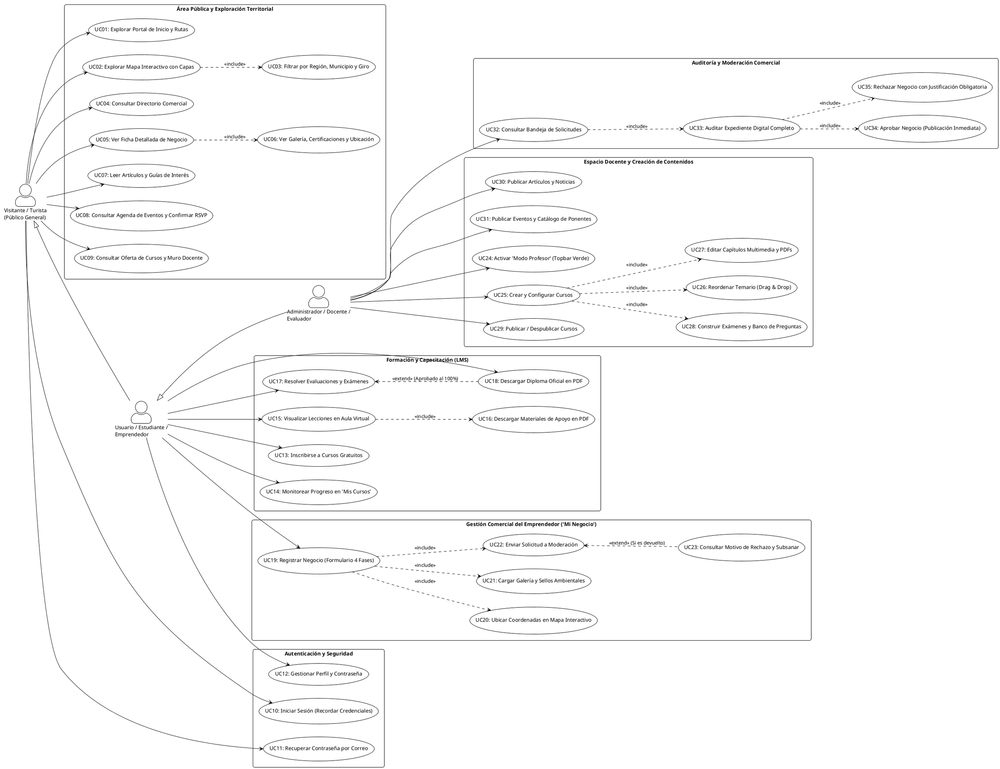
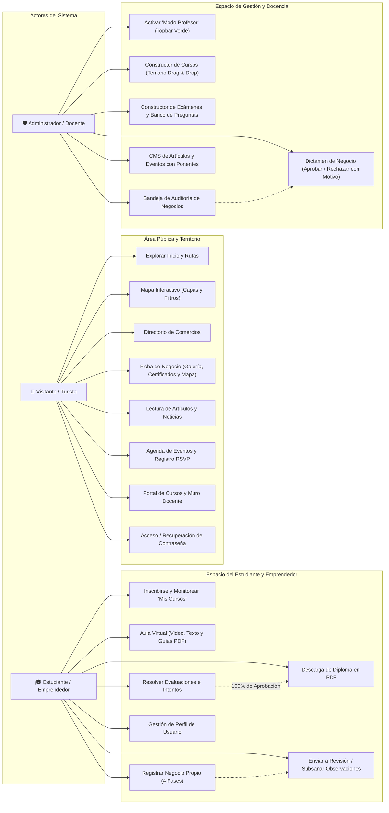
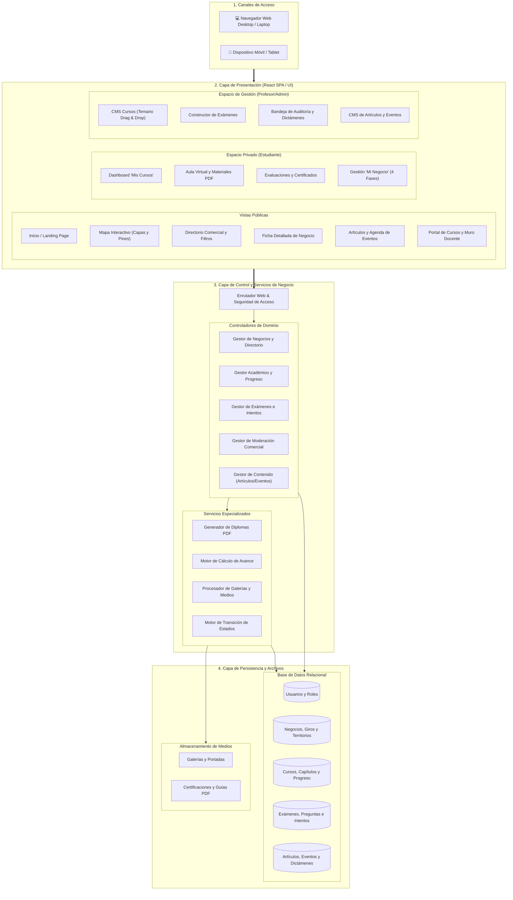
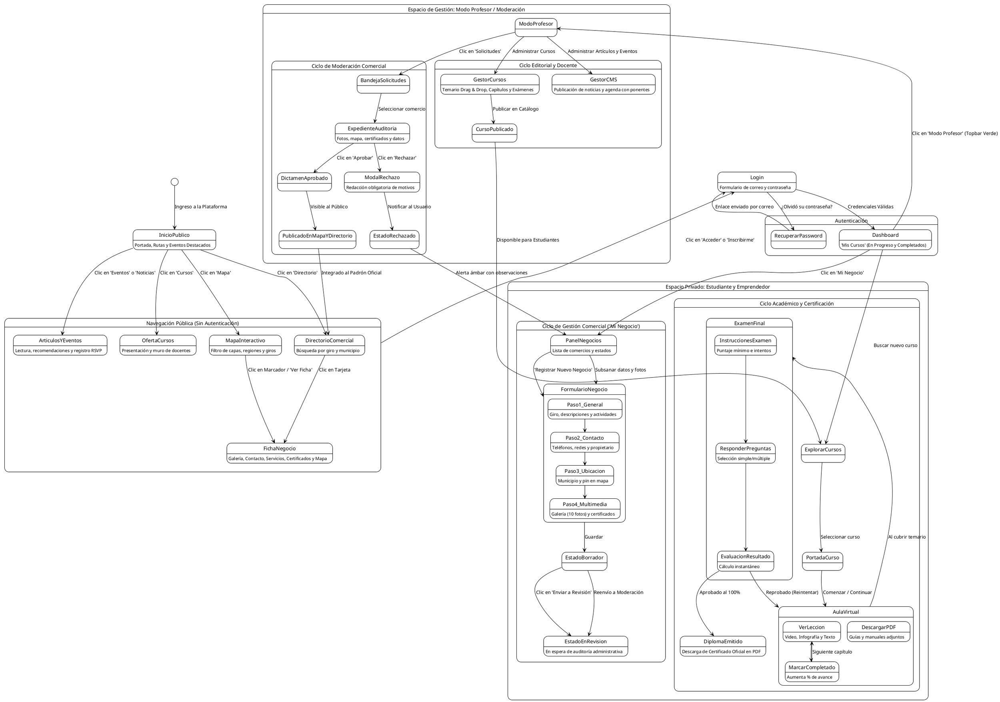
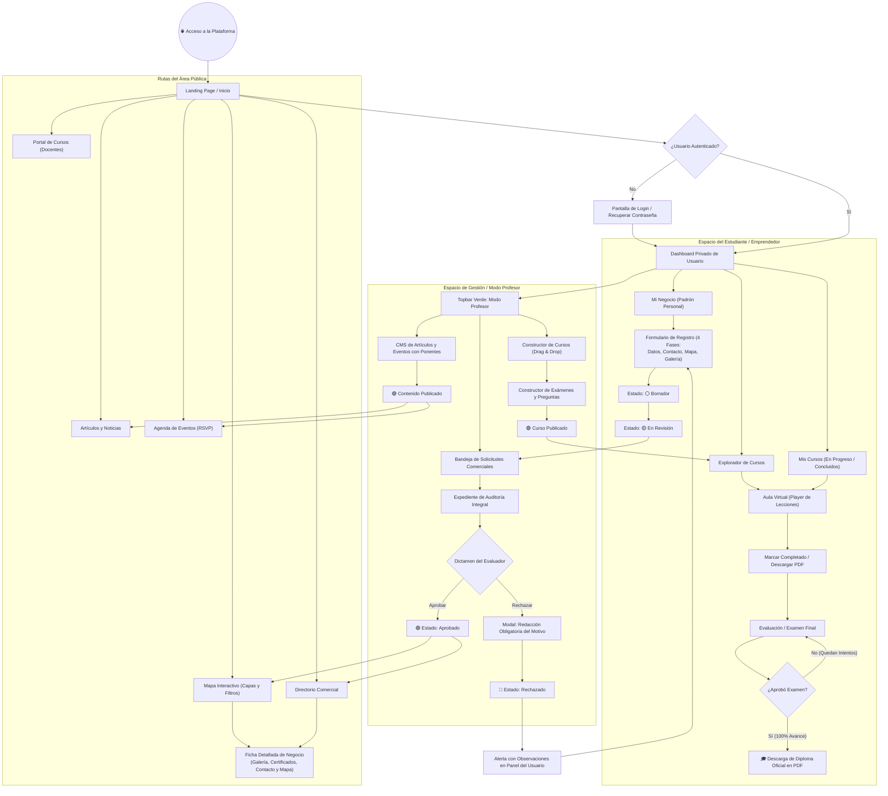

# **Documento de Diagramas: Casos de Uso, Arquitectura y Comportamiento de la Plataforma**

> **Referencia de Alcance:** Basado íntegramente en el [*Documento de Alcance de Evaluación: Arquitectura Visual y Módulos de la Plataforma Web V3*](file:///c:/Users/DaveCuc/Projects/turismo-platform/tests/react-inertia-starter-main/Documento%20de%20Alcance%20de%20Evaluaci%C3%B3n_%20Arquitectura%20y%20M%C3%B3dulos%20de%20la%20Plataforma%20V3.md).

Este documento reúne los tres diagramas fundamentales para el análisis, evaluación y comprensión integral del sistema:
1. **Diagrama de Casos de Uso del Sistema** (En sintaxis **Mermaid** y sintaxis compatible con **PlantUML / plantuml.com**).
2. **Diagrama de Arquitectura Conceptual y Modular de la Plataforma** (En sintaxis **Mermaid** y **PlantUML**).
3. **Diagrama de Comportamiento de Rutas, Flujos de Navegación y Ciclo de Estados** (En sintaxis **Mermaid** y **PlantUML**).

---

## **1. Diagrama de Casos de Uso del Sistema**

Modela las interacciones entre los actores del sistema y los diferentes módulos y funcionalidades disponibles.

### **1.1. Actores Identificados**
* 👤 **Visitante / Turista (Público General):** Usuario sin autenticar que navega por el portal, explora la reserva en el mapa, consulta el directorio de negocios, lee artículos, revisa eventos y consulta la oferta educativa.
* 🎓 **Usuario Autenticado / Estudiante / Emprendedor:** Usuario con cuenta activa que cursa capacitaciones, realiza exámenes, descarga certificados oficiales en PDF, registra y gestiona sus propios comercios turísticos y subsana observaciones.
* 🛡️ **Administrador / Docente / Evaluador:** Usuario con privilegios de gestión que activa el *Modo Profesor* para diseñar cursos y exámenes, audita y dictamina solicitudes comerciales (con aprobación o rechazo justificado) y gestiona noticias y eventos.

---

### **1.2. Versión en PlantUML (Compatible con [plantuml.com](https://www.plantuml.com/plantuml/uml/))**

---

### **1.3. Versión en Mermaid (Casos de Uso)**

---

## **2. Diagrama de Arquitectura de la Plataforma**

Representa la organización conceptual, modular y por capas del sistema, ilustrando cómo interactúan la interfaz de usuario, la capa de control, los servicios especializados y el almacenamiento de datos.

### **2.1. Versión en PlantUML (Compatible con [plantuml.com](https://www.plantuml.com/plantuml/uml/))**

```plantuml
@startuml
!theme plain
skinparam componentStyle rectangle
skinparam roundcorner 10
top to bottom direction

package "Dispositivos y Canales de Acceso" as CapaClientes {
    [💻 Navegadores de Escritorio / Laptops] as PC
    [📱 Teléfonos Inteligentes / Tablets] as Mobile
}

package "Capa de Presentación y Frontend (React SPA / UI)" as Frontend {
    
    package "Vistas Públicas" as UIPublica {
        [Navbar Reactivo y Footer Institucional] as NavFooter
        [Landing Page (Hero, Rutas, Eventos, Conócenos)] as ViewLanding
        [Mapa Interactivo (Capas, Regiones, Pines, Panel Lateral)] as ViewMapa
        [Directorio Comercial (Buscador y Tarjetas)] as ViewDirectorio
        [Ficha de Negocio (Galería, Certificados, Contacto, Mapa)] as ViewFicha
        [Visor de Artículos y Recomendados] as ViewArticulos
        [Agenda de Eventos y Ficha con RSVP] as ViewEventos
        [Portal de Cursos y Muro Docente] as ViewCursosPub
        [Módulo de Acceso y Recuperación] as ViewAuth
    }
    
    package "Vistas Privadas (Estudiante / Emprendedor)" as UIPrivada {
        [Sidebar de Navegación y Topbar de Usuario] as NavPrivado
        [Dashboard 'Mis Cursos' (Progreso y Completados)] as ViewMisCursos
        [Explorador de Cursos por Categoría] as ViewExplorarCursos
        [Aula Virtual (Visor Lección, Temario Lateral, PDF)] as ViewAula
        [Módulo de Exámenes (Instrucciones, Test y Resultados)] as ViewExamenes
        [Gestor 'Mi Negocio' (Asistente 4 Fases y Alertas de Rechazo)] as ViewMiNegocio
        [Perfil y Seguridad de Usuario] as ViewPerfil
    }
    
    package "Vistas de Gestión (Profesor / Moderador)" as UIGestion {
        [Topbar Verde 'Modo Profesor Activo'] as TopbarTeacher
        [CMS Cursos (Temario Drag & Drop, Editor Capítulos)] as ViewCMSCursos
        [Constructor Visual de Exámenes y Preguntas] as ViewCMSExamenes
        [Bandeja de Solicitudes y Expediente de Auditoría] as ViewAuditoria
        [CMS de Artículos y Noticias] as ViewCMSArticulos
        [CMS de Eventos y Directorio de Ponentes] as ViewCMSEventos
    }
}

package "Capa de Enrutamiento, Control y Lógica de Aplicación" as Backend {
    [Enrutador Web y Control de Acceso por Roles] as RouterControl
    
    package "Controladores de Dominio" as Controllers {
        [Controlador de Negocios y Directorio] as CtrlNegocios
        [Controlador Geográfico y Mapas] as CtrlMapas
        [Controlador Académico y Lecciones] as CtrlCursos
        [Controlador de Evaluaciones e Intentos] as CtrlExamenes
        [Controlador de Auditoría y Moderación] as CtrlModeracion
        [Controlador Editorial (Artículos y Eventos)] as CtrlContenido
        [Controlador de Perfil y Autenticación] as CtrlAuth
    }
    
    package "Motores y Servicios de Negocio" as Servicios {
        [Motor de Cálculo de Avance Porcentual] as MotorProgreso
        [Validador de Respuestas y Calificación de Exámenes] as MotorExamen
        [Generador de Diplomas Oficiales en PDF] as ServicioCertificados
        [Procesador y Optimizador de Fotografías y Galerías] as ServicioMedios
        [Motor de Flujo de Estados de Negocio\n(Borrador -> Revisión -> Aprobado/Rechazado)] as MotorEstados
    }
}

package "Capa de Persistencia y Almacenamiento" as Almacenamiento {
    database "Base de Datos Relacional" as DB {
        [Usuarios y Perfiles]
        [Negocios, Giros, Regiones y Municipios]
        [Cursos, Capítulos y Materiales]
        [Progreso de Usuarios y Compras Gratuitas]
        [Exámenes, Preguntas, Opciones e Intentos]
        [Artículos, Categorías y Eventos con Elenco]
        [Certificaciones Ambientales y Dictámenes]
    }
    
    folder "Sistema de Archivos y Medios Públicos" as Storage {
        [Imágenes de Portadas y Miniaturas]
        [Galerías Fotográficas de Comercios]
        [Documentos y Sellos de Certificación]
        [Manuales y Guías en PDF de Cursos]
        [Fotografías de Docentes y Ponentes]
    }
}

' Relaciones entre capas
CapaClientes --> Frontend : Acceso vía HTTPS
Frontend --> RouterControl : Peticiones y Navegación
RouterControl --> Controllers : Despacho de Acciones
Controllers --> Servicios : Lógica de Negocio
Controllers --> DB : Consultas y Transacciones
Servicios --> Storage : Lectura y Escritura de Archivos
Servicios --> DB : Registro de Estados y Avances

@enduml
```

---

### **2.2. Versión en Mermaid (Arquitectura Conceptual)**

---

## **3. Diagrama de Comportamiento de Rutas y Ciclo de Estados**

Muestra el flujo de navegación integral del usuario, el ciclo de vida de los registros comerciales y el proceso formativo de evaluación y certificación.

### **3.1. Versión en PlantUML (Compatible con [plantuml.com](https://www.plantuml.com/plantuml/uml/))**

---

### **3.2. Versión en Mermaid (Flujo General y Ciclo de Estados)**

---

## **4. Guía de Uso y Exportación de los Diagramas**

### **¿Cómo utilizar los códigos PlantUML?**
1. Copia el bloque de código encerrado entre `@startuml` y `@enduml`.
2. Ingresa a [https://www.plantuml.com/plantuml/uml/](https://www.plantuml.com/plantuml/uml/).
3. Pega el código en el editor web.
4. El diagrama se renderizará automáticamente en formato gráfico de alta definición y podrás exportarlo en **PNG, SVG o PDF**.

### **¿Cómo visualizar los códigos Mermaid?**
1. Los bloques Mermaid se renderizan de forma nativa en la mayoría de visores de Markdown (como GitHub, GitLab, VS Code, Antigravity IDE, Notion u Obsidian).
2. También puedes pegarlos en [Mermaid Live Editor](https://mermaid.live/) para exportarlos como imagen o integrarlos en presentaciones ejecutivas.
